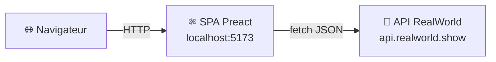

# MIGRATION_STEP.md — step-00-spa-json

## Nom de la branche

`step-00-spa-json`

---

## Objectif du step

Point de départ : la SPA Preact **telle quelle**, sans aucune modification.

Cette branche sert de référence. Elle permet de comparer le comportement, les routes réseau, l'UX et les échanges API avec les steps suivants, au moment de la démo.

---

## Ce qu'on voit dans le navigateur

- L'application RealWorld Conduit complète, 100 % rendue côté client.
- Onglet Réseau : toutes les requêtes vont vers `https://api.realworld.show/api` et retournent du **JSON**.
- Aucun backend Go, aucun reverse proxy. Juste Vite + Preact.

---

## Lancer l'application

```bash
cd preact-realworld-example-app
npm ci
npm run dev
```

Ouvrir : **http://localhost:5173**

---

## Architecture



Tout est dans le navigateur. Le serveur ne sert que les fichiers statiques (JS, CSS, HTML). La logique de rendu, le routing, la gestion d'état — tout est côté client.

---

## Contenu de cette branche

```
.
├── preact-realworld-example-app/   # SPA Preact — état original, non modifié
│   ├── public/
│   │   ├── components/             #   composants Preact (PopularTags, ArticlePreview, …)
│   │   ├── pages/                  #   pages (Home, Article, Profile, …)
│   │   ├── services/api/           #   appels JSON vers api.realworld.show
│   │   └── store/                  #   état global (authentification)
│   ├── package.json
│   └── vite.config.ts
├── AGENTS.md
├── MIGRATION_STEP.md               # ce fichier
└── README.md
```

---

## Commandes de vérification

```bash
cd preact-realworld-example-app
npm run build   # doit produire dist/ sans erreur
```

---

## Point narratif pour la démo

> *"Voilà notre point de départ. Une SPA Preact classique : tout se passe dans le navigateur. Si on ouvre l'onglet Réseau, on voit que chaque interaction déclenche une requête JSON vers l'API. Le serveur ne connaît pas l'HTML — il envoie du JSON, et c'est Preact qui construit le DOM.*
>
> *C'est le modèle SPA classique. Il fonctionne. Maintenant on va le faire évoluer, composant par composant, sans que l'utilisateur ne remarque quoi que ce soit."*

---

## Ce qui n'existe pas encore dans cette branche

- Pas de backend Go (`go-hda-backend/` absent)
- Pas de reverse proxy (`reverse-proxy/` absent)
- Pas d'HTMX
