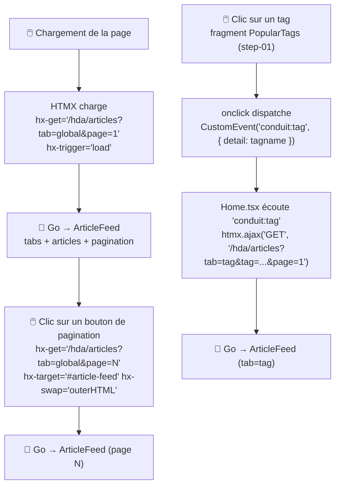

# MIGRATION_STEP.md — step-02-article-feed

## Nom de la branche

`step-02-article-feed`

---

## Objectif du step

Migrer le fil d'articles de la page d'accueil vers un fragment HTML servi par le backend Go :
**ArticleFeed** — la colonne centrale de la Home page (tabs + liste d'articles + pagination).

Après step-01, la sidebar PopularTags était déjà rendue côté serveur. Mais la colonne principale — l'essentiel du contenu — restait entièrement gérée par Preact : six states, un appel API dans un `useEffect`, un rendu JSX complet.

En step-02, cette colonne devient elle aussi un point de montage HTMX. Le fragment Go est **auto-rafraîchissant** : les boutons de pagination et les onglets de navigation sont dans le fragment lui-même, avec leur `hx-get` intégré. Le seul JavaScript conservé dans Preact est un pont de six lignes qui relaie l'événement DOM `conduit:tag` vers HTMX.

---

## Différence avec step-01

| | step-01-go-hda-proxy | step-02-article-feed |
|---|---|---|
| PopularTags sidebar | Fragment HTML Go | Fragment HTML Go (inchangé) |
| Fil d'articles | Rendu Preact (useEffect + apiGetArticles) | Fragment HTML Go |
| Pagination | Composant Preact `<Pagination>` | Rendue dans le fragment Go, navigation HTMX |
| Onglets (Global / # tag) | Gérés par état Preact | Rendus dans le fragment Go, navigation HTMX |
| States dans Home.tsx | 6 (articles, articlesCount, isLoading, page, currentActiveTab, tag) | 1 (isAuthenticated) |
| `useEffect` fetchFeeds | Présent (appel API JSON) | Supprimé |
| `useEffect` conduit:tag | setState Preact | `htmx.ajax()` — pont vers le fragment Go |
| Route Go ajoutée | — | `GET /hda/articles?tab&tag&page` |
| Concept HTMX introduit | Fragment sans paramètres (`hx-trigger="load"`) | Fragment paramétré + auto-rafraîchissant |

---

## Dossiers et fichiers modifiés / créés

### Créés

```
go-hda-backend/
└── internal/
    ├── api/
    │   └── articles.go              ← GetArticles(page, tag) → []Article, total, error
    └── templates/
        ├── articles.templ           ← template du fragment ArticleFeed
        └── articles_templ.go        ← généré par templ generate (ne pas éditer à la main)
```

### Modifiés

#### `go-hda-backend/internal/api/types.go` — ajout des types articles

```diff
+// Author représente l'auteur d'un article.
+type Author struct {
+	Username  string `json:"username"`
+	Image     string `json:"image"`
+	Following bool   `json:"following"`
+}
+
+// Article représente un article RealWorld.
+type Article struct {
+	Slug           string   `json:"slug"`
+	Title          string   `json:"title"`
+	Description    string   `json:"description"`
+	TagList        []string `json:"tagList"`
+	CreatedAt      string   `json:"createdAt"`
+	Favorited      bool     `json:"favorited"`
+	FavoritesCount int      `json:"favoritesCount"`
+	Author         Author   `json:"author"`
+}
+
+// ArticlesResponse est la réponse de l'endpoint GET /articles.
+type ArticlesResponse struct {
+	Articles      []Article `json:"articles"`
+	ArticlesCount int       `json:"articlesCount"`
+}
```

#### `go-hda-backend/internal/handlers/articles.go` — nouveau handler

```go
// ArticlesHandler gère GET /hda/articles.
//
// Query params :
//   - tab  : "global" (défaut) ou "tag"
//   - tag  : nom du tag filtré (utilisé quand tab=tag)
//   - page : numéro de page 1-indexé (défaut 1)
func ArticlesHandler(c echo.Context) error { ... }
```

#### `go-hda-backend/cmd/server/main.go` — enregistrement de la route

```diff
 // step-01 : PopularTags sidebar
 e.GET("/hda/tags", handlers.TagsHandler)
+
+// step-02 : fil d'articles (Global Feed + Tag Feed + Pagination)
+e.GET("/hda/articles", handlers.ArticlesHandler)
```

#### `public/pages/Home.tsx` — simplification massive

```diff
-import { useEffect, useState } from 'preact/hooks';
-import { ArticlePreview } from '../components/ArticlePreview';
-import { LoadingIndicator } from '../components/LoadingIndicator';
-import { Pagination } from '../components/Pagination';
-import { apiGetArticles, apiGetFeed } from '../services/api/article';
+import { useEffect } from 'preact/hooks';
 import { PopularTags } from '../components/PopularTags';
 import { useStore } from '../store';

 export default function HomePage() {
 	const isAuthenticated = useStore(state => !!state.user);

-	const [articles, setArticles] = useState<Article[]>([]);
-	const [articlesCount, setArticlesCount] = useState(0);
-	const [page, setPage] = useState(1);
-	const [currentActiveTab, setCurrentActiveTab] = useState(isAuthenticated ? 'personal' : 'global');
-	const [tag, setTag] = useState('');
-	const [isLoading, setIsLoading] = useState(false);
-
-	useEffect(() => {
-		(async function fetchFeeds() {
-			setIsLoading(true);
-			// ... appel API JSON + setArticles
-		})();
-	}, [currentActiveTab, page, tag]);
-
 	useEffect(() => {
 		const handler = (e: Event) => {
-			const selectedTag = (e as CustomEvent<string>).detail;
-			setCurrentActiveTab('tag');
-			setTag(selectedTag);
-			setPage(1);
+			const tag = (e as CustomEvent<string>).detail;
+			window.htmx.ajax('GET', `/hda/articles?tab=tag&tag=${encodeURIComponent(tag)}&page=1`, {
+				target: '#article-feed',
+				swap: 'outerHTML',
+			});
 		};
 		document.addEventListener('conduit:tag', handler);
 		return () => document.removeEventListener('conduit:tag', handler);
 	}, []);

 	// ...
-					{isLoading ? (
-						<LoadingIndicator ... />
-					) : articles.length > 0 ? (
-						articles.map(article => <ArticlePreview key={article.slug} article={article} />)
-					) : (
-						<div class="article-preview">No articles are here... yet.</div>
-					)}
-					{!isLoading && <Pagination count={articlesCount} page={page} setPage={setPage} />}
+					<div
+						id="article-feed"
+						hx-get="/hda/articles?tab=global&page=1"
+						hx-trigger="load"
+						hx-swap="outerHTML"
+					/>
```

#### `public/types/global.d.ts` — déclaration de `window.htmx`

```diff
+interface HtmxAjaxOptions {
+	target?: string | Element;
+	swap?: string;
+	values?: Record<string, string>;
+	headers?: Record<string, string>;
+}
+
+interface Htmx {
+	ajax(method: string, url: string, options?: HtmxAjaxOptions | string | Element): void;
+	process(element: Element): void;
+}
+
+interface Window {
+	htmx: Htmx;
+}
```

### Non modifiés

- `go-hda-backend/internal/templates/tags.templ` et handler tags (step-01 intact)
- `preact-realworld-example-app/public/components/ArticlePreview.tsx` — toujours utilisé par `Profile.tsx`
- `preact-realworld-example-app/public/components/Pagination.tsx` — toujours utilisé par `Profile.tsx`
- `presentation/` (règle absolue — jamais modifié dans une branche step-*)

---

## Fragment HTML généré par Go (`go-hda-backend`)

Le template `templ` qui produit le HTML renvoyé par `GET /hda/articles` :

```go
// internal/templates/articles.templ
templ ArticleFeed(articles []api.Article, tab string, tag string, page int, totalPages int) {
    <div id="article-feed">
        <!-- Tab bar — chaque onglet recharge #article-feed via hx-get -->
        <div class="feed-toggle">
            <ul class="nav nav-pills outline-active">
                <li class="nav-item">
                    <a class="nav-link [active si tab=global]"
                       hx-get="/hda/articles?tab=global&page=1"
                       hx-target="#article-feed"
                       hx-swap="outerHTML">Global Feed</a>
                </li>
                if tab == "tag" {
                    <li class="nav-item">
                        <a class="nav-link active"># { tag }</a>
                    </li>
                }
            </ul>
        </div>

        <!-- Liste d'articles ou message vide -->
        for _, article := range articles {
            // carte article (titre, auteur, date, favoris désactivé en step-02)
        }

        <!-- Pagination — chaque bouton recharge #article-feed -->
        <ul class="pagination">
            for i := range totalPages {
                <li class="page-item [active si page courante]">
                    <a hx-get="/hda/articles?tab=...&tag=...&page=N"
                       hx-target="#article-feed"
                       hx-swap="outerHTML">N</a>
                </li>
            }
        </ul>
    </div>
}
```

Points clés :
- `id="article-feed"` : cible stable pour les `hx-target` des boutons de pagination et des onglets.
- `hx-swap="outerHTML"` : le fragment se remplace lui-même, `id="article-feed"` reste présent dans chaque réponse.
- Le fragment est autonome : une fois monté, il ne nécessite aucun JavaScript pour la navigation interne.

---

## Architecture de communication après step-02



**Pourquoi un pont JS plutôt que HTMX natif pour `conduit:tag` ?**

L'événement `conduit:tag` est dispatché par le fragment PopularTags avec la valeur du tag dans `event.detail`. HTMX ne peut pas lire `event.detail` pour construire dynamiquement l'URL du `hx-get`. Le pont JavaScript (6 lignes dans `Home.tsx`) traduit cet événement en appel `htmx.ajax()` avec l'URL correcte. C'est le seul couplage JS restant entre les deux fragments Go.

---

## Commandes de lancement

### Mode stack complète (Docker + Traefik) — recommandé

```bash
cd reverse-proxy
cp .env.example .env
docker compose up --build
```

Ouvrir : **http://localhost:1337**

| URL | Service |
|-----|---------|
| http://localhost:1337 | Application complète (SPA + fragments Go via Traefik) |
| http://localhost:8080 | Dashboard Traefik |

### Mode développement (sans Docker)

> ⚠️ Sans Traefik, les `hx-get="/hda/..."` dans la SPA (port 8080) ne trouveront pas le backend Go (port 3000). Utiliser la stack Docker est recommandé.

**Terminal 1 — Backend Go (port 3000) :**
```bash
cd go-hda-backend
make dev   # templ generate --watch + go run
```

**Terminal 2 — SPA Preact (port 8080) :**
```bash
cd preact-realworld-example-app
npm ci && npm run start
```

---

## Commandes de vérification

```bash
# Build + vet Go
cd go-hda-backend && go build ./... && go vet ./...

# Génération templ (doit produire articles_templ.go sans erreur)
cd go-hda-backend && make templ

# Build SPA
cd preact-realworld-example-app && npm run build

# Tester les fragments manuellement (backend Go lancé)
curl http://localhost:3000/hda/tags                            # → HTML sidebar tags
curl http://localhost:3000/hda/articles                       # → HTML feed global page 1
curl "http://localhost:3000/hda/articles?tab=tag&tag=react"   # → HTML feed filtré par tag
curl "http://localhost:3000/hda/articles?tab=global&page=2"   # → HTML feed global page 2

# Vérifier que presentation/ n'est pas touché dans ce step
git diff --name-only trunk...HEAD | grep presentation/ && echo "ERREUR : presentation/ modifié" || echo "OK : presentation/ non touché"
```

---

## Point narratif pour la démo

> *"En step-01, on avait migré la sidebar des tags — un fragment simple, sans paramètre. Maintenant regardons la colonne principale : les articles. Dans le code Preact, il n'y a plus d'appel API, plus de state articles, plus de composant Pagination. Juste un `<div id="article-feed">` avec un `hx-get`.*
>
> *Ouvrez l'onglet Réseau. Au chargement de la page, vous voyez une requête vers `/hda/articles` qui retourne du HTML — la liste entière, avec les onglets et la pagination dedans. Si je clique sur la page 2 : une nouvelle requête, un nouveau fragment. Pas de JavaScript côté client pour gérer ça.*
>
> *Et si je clique sur un tag dans la sidebar — qui est, rappelons-le, un autre fragment Go — Home.tsx sert de pont : il écoute l'événement DOM et dit à HTMX 'recharge le feed avec ce tag'. Six lignes de code. C'est tout ce qui reste comme JavaScript pour gérer le fil d'articles."*

---

## Limites connues et ce qui reste côté SPA

- Le bouton **"favorite" (❤)** est rendu en HTML mais désactivé (`disabled`) — la route `POST /hda/articles/:slug/favorite` est hors périmètre en step-02.
- **"Your Feed"** (feed personnel authentifié) n'est pas migré — il nécessite le JWT et le middleware session, prévu pour un step ultérieur.
- `Profile.tsx` reste en Preact pur et continue d'utiliser `ArticlePreview` et `Pagination` (composants Preact conservés).
- Aucun test automatisé pour le backend Go dans ce step.
