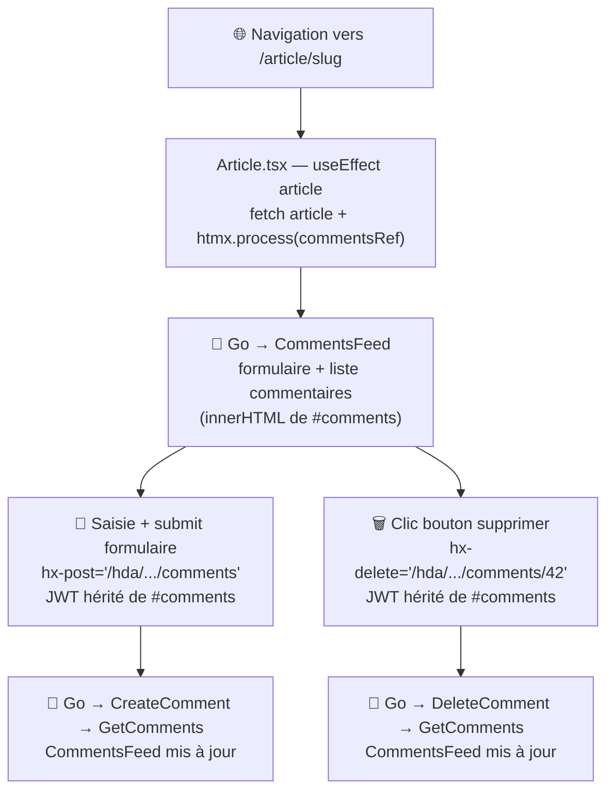

# MIGRATION_STEP.md — step-04-comments

## Nom de la branche

`step-04-comments`

---

## Objectif du step

Migrer la **section commentaires** de la page article (`/article/:slug`) vers un fragment HTML
servi par le backend Go : formulaire d'ajout, liste de commentaires, bouton de suppression.

Ce step introduit les **opérations d'écriture via HTMX** (`hx-post`, `hx-delete`) — les trois
steps précédents n'utilisaient que `hx-get`. Il introduit également la **propagation du JWT**
depuis la SPA Preact vers le backend Go via `hx-headers` hérité.

Le corps de l'article et les métadonnées (`ArticleMeta`) restent intentionnellement en Preact :
ils nécessitent un rendu Markdown et des interactions (favorite, follow) liées à l'authentification.

---

## Différence avec step-03

| | step-03-profile | step-04-comments |
|---|---|---|
| Commentaires (liste) | Rendu Preact (`{comments.map(...)}`) | Fragment HTML Go |
| Formulaire ajout commentaire | Preact (`onSubmit → apiCreateComment`) | `hx-post` Go |
| Bouton supprimer | Preact (`onClick → apiDeleteComment`) | `hx-delete` Go |
| States dans Article.tsx | 4 (article, comments, commentBody, isLoading) | 2 (article, isLoading) |
| JWT dans HTMX | — | `hx-headers` injecté par Preact, hérité par enfants Go |
| Verbes HTTP HTMX | GET uniquement | GET + POST + DELETE |
| `hx-swap` | `outerHTML` | **`innerHTML`** (le div parent reste pour conserver `hx-headers`) |

---

## Nouveau concept : `hx-headers` hérité + `innerHTML`

```
Article.tsx (Preact)
│
└── <div id="comments"
         hx-get="/hda/articles/{slug}/comments?username=...&userImage=..."
         hx-trigger="load"
         hx-swap="innerHTML"          ← innerHTML : le div reste dans le DOM
         hx-headers='{"Authorization":"Token xxx"}'>   ← JWT injecté par Preact

         │  Go rend à l'intérieur — hérite automatiquement de hx-headers
         │
         ├── <form hx-post="/hda/articles/{slug}/comments"
         │         hx-target="#comments" hx-swap="innerHTML">
         │     <input type="hidden" name="username" value="..."/>
         │     <input type="hidden" name="userImage" value="..."/>
         │     <textarea name="body"/>
         │   </form>
         │
         └── <div class="card">
               <i hx-delete="/hda/articles/{slug}/comments/42"
                  hx-target="#comments" hx-swap="innerHTML"
                  hx-vals='{"username":"..."}'>
             </div>
```

**Pourquoi `innerHTML` et non `outerHTML` ?**

Avec `outerHTML`, le `div#comments` est remplacé à chaque requête — ses `hx-headers` disparaissent
du DOM. Les enfants Go perdent le JWT. Avec `innerHTML`, le div parent reste en place et ses attributs
HTMX sont hérités par tous les éléments enfants, y compris ceux rendus par Go.

---

## Routes Go ajoutées

| Verbe | Route | Handler |
|---|---|---|
| GET | `/hda/articles/:slug/comments` | `CommentsHandler` |
| POST | `/hda/articles/:slug/comments` | `CreateCommentHandler` |
| DELETE | `/hda/articles/:slug/comments/:id` | `DeleteCommentHandler` |

---

## Propagation du username après POST/DELETE

Go doit connaître l'utilisateur connecté pour :
1. Afficher le formulaire (si authentifié)
2. Afficher le bouton supprimer (si auteur du commentaire)

Le JWT ne peut pas être décodé côté Go sans bibliothèque JWT. Solution simple :

- Chargement initial : `username` et `userImage` passés en **query params**
- POST : `username` et `userImage` en **hidden fields** dans le formulaire
- DELETE : `username` via **`hx-vals`** sur le bouton

Après chaque mutation, Go re-fetch les commentaires et re-rend `CommentsFeed` avec les bons paramètres.

---

## Diff Preact — Article.tsx

```diff
-import { useEffect, useState } from 'preact/hooks';
+import { useEffect, useRef, useState } from 'preact/hooks';

-import { ArticleCommentCard } from '../components/ArticleCommentCard';
-import { apiCreateComment, apiGetComments } from '../services/api/comments';

 export default function ArticlePage(props) {
   const [article, setArticle] = useState(undefined);
-  const [comments, setComments] = useState([]);
-  const [commentBody, setCommentBody] = useState('');
   const [isLoading, setIsLoading] = useState(false);
+  const commentsRef = useRef(null);
   const user = useStore(state => state.user);

-  const postComment = async (e) => {
-    e.preventDefault();
-    const comment = await apiCreateComment(slug, commentBody);
-    setCommentBody('');
-    setComments(prev => [comment, ...prev]);
-  };

   useEffect(() => {
-    setComments(await apiGetComments(slug));
+    if (commentsRef.current) window.htmx.process(commentsRef.current);
-  }, [slug]);
+  }, [article]);

+  // Point de montage HTMX — step-04
+  <div
+    id="comments"
+    ref={commentsRef}
+    hx-get={commentsUrl}
+    hx-trigger="load"
+    hx-swap="innerHTML"
+    hx-headers={hxHeaders}
+  />

-  // Formulaire Preact + {comments.map(comment => <ArticleCommentCard ... />)}
```

---

## Fichiers modifiés / créés

| Fichier | Action |
|---|---|
| `go-hda-backend/internal/api/types.go` | ajout `Comment`, `CommentsResponse`, `CommentResponse` |
| `go-hda-backend/internal/api/comments.go` | créé — `GetComments`, `CreateComment`, `DeleteComment` |
| `go-hda-backend/internal/handlers/comments.go` | créé — 3 handlers GET/POST/DELETE |
| `go-hda-backend/internal/templates/comments.templ` | créé — `CommentsFeed`, `commentCard` |
| `go-hda-backend/internal/templates/comments_templ.go` | généré par `make templ` |
| `go-hda-backend/cmd/server/main.go` | 3 nouvelles routes |
| `preact-realworld-example-app/public/pages/Article.tsx` | states 4→2, point de montage HTMX |

### Non modifiés

- `go-hda-backend/internal/templates/articles.templ` — `articleCard` et `formatDate` réutilisés
- Corps de l'article et `ArticleMeta` — restent en Preact
- `presentation/` (règle absolue — jamais modifié dans une branche step-*)

---

## Architecture de communication après step-04



---

## Commandes de lancement

### Mode stack complète (Docker + Traefik) — recommandé

```bash
cd reverse-proxy
cp .env.example .env
docker compose up --build
```

Ouvrir : **http://localhost:1337**

### Mode développement (sans Docker)

```bash
# Terminal 1 — Backend Go
cd go-hda-backend && make dev

# Terminal 2 — SPA Preact
cd preact-realworld-example-app && npm ci && npm run start
```

---

## Commandes de vérification

```bash
# Build + vet Go
cd go-hda-backend && go build ./... && go vet ./...

# Génération templ
cd go-hda-backend && make templ

# Tester les fragments manuellement (backend Go lancé)
curl http://localhost:3000/hda/tags
curl "http://localhost:3000/hda/articles?tab=global&page=1"
curl "http://localhost:3000/hda/articles/slug/comments"

# Vérifier que presentation/ n'est pas touché
git diff --name-only trunk...HEAD | grep presentation/ && echo "ERREUR" || echo "OK"
```

---

## Point narratif pour la démo

> *"Jusqu'ici on a fait que du GET — lire des données. Maintenant on passe à l'écriture.
> Sur la page article, la section commentaires : poster un commentaire, supprimer le sien.*
>
> *Le défi : les opérations d'écriture nécessitent le JWT de l'utilisateur. Mais ce JWT
> vit dans le store Zustand de Preact. Comment le transmettre à HTMX sans le stocker
> dans un cookie ou le réécrire dans Go ?*
>
> *La réponse : `hx-headers` + `innerHTML`. Preact injecte le JWT une seule fois sur le
> div conteneur. Comme on utilise `innerHTML` au lieu de `outerHTML`, ce div reste dans
> le DOM. Tous les éléments Go à l'intérieur — le formulaire, les boutons supprimer —
> héritent automatiquement du header Authorization. Zero duplication, zero cookie."*

---

## Limites connues

- **Bouton favorite (❤)** dans les cartes d'articles reste non fonctionnel (hérité de step-02).
- **"Your Feed"** sur Home reste hors périmètre.
- `Article.tsx` conserve l'appel API JSON (`apiGetArticle`) et le rendu Markdown.
- Aucun test automatisé pour le backend Go.
