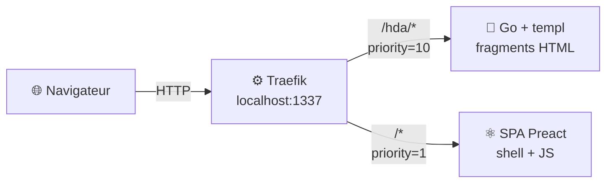
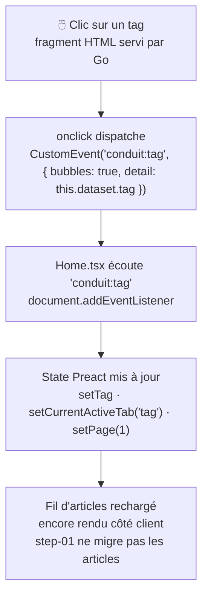

# MIGRATION_STEP.md — step-01-go-hda-proxy

## Nom de la branche

`step-01-go-hda-proxy`

---

## Objectif du step

Migrer le premier composant de la SPA Preact vers un fragment HTML servi par le backend Go :
**PopularTags** — la sidebar des tags populaires sur la page d'accueil.

L'utilisateur accède toujours à une **URL unique** (`http://localhost:1337`). Il ne sait pas, et n'a pas besoin de savoir, que la sidebar est désormais rendue côté serveur en Go. Le résultat dans le DOM est identique.

Ce step pose également l'infrastructure complète : backend Go, reverse proxy Traefik, et le pattern de communication entre le HTML Go et le JS Preact.

---

## Différence avec step-00-spa-json

| | step-00-spa-json | step-01-go-hda-proxy |
|---|---|---|
| PopularTags | Rendu côté client (Preact + fetch JSON) | Fragment HTML côté serveur (Go + templ) |
| Chargement des tags | `apiGetAllTags()` dans un `useEffect` | `hx-get="/hda/tags"` → backend Go |
| Communication avec la SPA | Callback `onClick` prop | Événement DOM custom `conduit:tag` |
| URL de l'application | `http://localhost:8080` | `http://localhost:1337` (via Traefik) |
| Reverse proxy | Aucun | Traefik sur `:1337` |
| Backend Go | Absent | Présent, sert uniquement `/hda/tags` |

---

## Dossiers et fichiers modifiés / créés

### Créés

```
go-hda-backend/
├── Dockerfile                       ← multi-stage : builder Go + runtime alpine
├── Makefile                         ← targets : build, run, dev, templ, vet, clean
├── go.mod / go.sum
├── cmd/
│   └── server/
│       └── main.go                  ← serveur Echo, route GET /hda/tags
└── internal/
    ├── api/
    │   ├── client.go                ← client HTTP vers api.realworld.show, JWT optionnel
    │   ├── types.go                 ← TagsResponse, ErrorResponse, APIError
    │   └── tags.go                  ← GetTags() → []string
    ├── handlers/
    │   └── tags.go                  ← handler GET /hda/tags → fragment HTML
    └── templates/
        ├── tags.templ               ← template templ du fragment PopularTags
        └── tags_templ.go            ← généré par templ generate (ne pas éditer à la main)

reverse-proxy/
├── .env.example
├── docker-compose.yml               ← Traefik v2.11 + Go backend + SPA, routing PathPrefix
└── traefik/
    └── traefik.yml                  ← entrypoint :1337, provider Docker

preact-realworld-example-app/
└── Dockerfile                       ← build Vite + serve statique
```

### Modifiés

#### `public/index.html` — chargement de HTMX via CDN

```diff
+		<!-- HTMX — permet aux fragments HTML servis par Go de s'intégrer dans la SPA -->
+		<script src="https://unpkg.com/htmx.org@2.0.4"
+		        integrity="sha384-HGfztofotfshcF7+8n44JQL2oJmowVChPTg48S+jvZoztPfvwD79OC/LTtG6dMp+"
+		        crossorigin="anonymous"></script>
 		<link rel="preload" as="script" href="/index.tsx" crossorigin />
```

#### `public/components/PopularTags.tsx` — remplacement par le point de montage HTMX

```diff
-import { useEffect, useState } from 'preact/hooks';
-import { LoadingIndicator } from './LoadingIndicator';
-import { apiGetAllTags } from '../services/api/tags';
-
-interface PopularTagsProps {
-	onClick: (tag: string) => void;
-}
-
-export function PopularTags(props: PopularTagsProps) {
-	const [tags, setTags] = useState<string[]>([]);
-	const [loading, setLoading] = useState(false);
-
-	useEffect(() => {
-		(async function getAllTags() {
-			setLoading(true);
-			setTags(await apiGetAllTags());
-			setLoading(false);
-		})();
-	}, []);
-
+export function PopularTags() {
 	return (
-		<div class="sidebar">
-			<p>Popular Tags</p>
-			<div class="tag-list">
-				<LoadingIndicator show={loading} width="1em" />
-				{tags.map(tag => (
-					<a key={tag} href="#" class="tag-pill tag-default" onClick={() => props.onClick(tag)}>
-						{tag}
-					</a>
-				))}
-			</div>
-		</div>
+		<div
+			hx-get="/hda/tags"
+			hx-trigger="load"
+			hx-swap="outerHTML"
+		/>
 	);
 }
```

Le composant Preact n'a plus aucune logique : il n'est qu'un point de montage. HTMX charge le fragment dès que l'élément entre dans le DOM (`hx-trigger="load"`) et remplace l'élément lui-même (`hx-swap="outerHTML"`).

#### `public/pages/Home.tsx` — écoute de l'événement DOM `conduit:tag`

```diff
+	useEffect(() => {
+		const handler = (e: Event) => {
+			const selectedTag = (e as CustomEvent<string>).detail;
+			setCurrentActiveTab('tag');
+			setTag(selectedTag);
+			setPage(1);
+		};
+		document.addEventListener('conduit:tag', handler);
+		return () => document.removeEventListener('conduit:tag', handler);
+	}, []);

 	// ...

-						<PopularTags
-							onClick={(tag: string) => {
-								setCurrentActiveTab('tag');
-								setTag(tag);
-							}}
-						/>
+						{/* PopularTags est maintenant un point de montage HTMX. */}
+						<PopularTags />
```

#### `public/types/global.d.ts` — déclarations TypeScript pour les attributs `hx-*`

Fichier créé pour éviter les erreurs TypeScript sur les attributs HTMX dans JSX :

```ts
declare namespace preact.JSX {
	export interface HTMLAttributes<RefType extends EventTarget = EventTarget> {
		'hx-get'?: string;
		'hx-trigger'?: string;
		'hx-swap'?: string;
		// ...
	}
}
```

---

### Fragment HTML généré par Go (`go-hda-backend`)

Le template `templ` qui produit le HTML renvoyé par `GET /hda/tags` :

```go
// internal/templates/tags.templ
templ TagsSidebar(tags []string) {
	<div class="sidebar">
		<p>Popular Tags</p>
		<div class="tag-list">
			for _, tag := range tags {
				<a
					class="tag-pill tag-default"
					href="#"
					data-tag={ tag }
					onclick="event.preventDefault(); document.dispatchEvent(new CustomEvent('conduit:tag', { bubbles: true, detail: this.dataset.tag }))"
				>{ tag }</a>
			}
		</div>
	</div>
}
```

Points clés :
- `data-tag={ tag }` : valeur du tag en attribut HTML — jamais interpolée dans une chaîne JS (protection XSS).
- `this.dataset.tag` : lecture de la valeur au moment du clic.
- `CustomEvent('conduit:tag', { bubbles: true, detail: ... })` : l'événement remonte le DOM jusqu'à ce que `Home.tsx` l'intercepte via `document.addEventListener`.

### Non modifiés

- Reste de `preact-realworld-example-app/` (SPA intacte)
- `presentation/` (règle absolue — jamais modifié dans une branche step-*)

---

## Décisions structurantes

### Routing : PathPrefix sur URL unique



Traefik route par `PathPrefix`. La route `/hda/` a une priorité explicite plus haute (`priority=10`) que le catch-all `/` (`priority=1`). Aucune entrée `/etc/hosts` nécessaire.

### Communication HTMX → SPA via événement DOM

Quand l'utilisateur clique un tag dans le fragment Go :



Ce pattern **découple le HTML Go du JS Preact** : les deux parties communiquent via le DOM, sans se connaître directement. C'est intentionnel et pédagogique.

Pourquoi `data-tag` + `this.dataset.tag` au lieu de la valeur directement en JS ?
→ Évite toute injection XSS : la valeur du tag n'est jamais interpolée dans une chaîne JavaScript.

### Périmètre du Go backend

En step-01, le Go backend n'expose qu'une seule route : `GET /hda/tags`.
Aucune route de page complète n'est enregistrée. Le backend grossira à chaque step suivant.

Le middleware `internal/middleware/` est présent dans les sources mais n'est pas utilisé en step-01 (aucune route protégée). Il sera activé quand des routes authentifiées seront ajoutées.

---

## Commandes de lancement

### Mode stack complète (Docker + Traefik) — recommandé

```bash
cd reverse-proxy
cp .env.example .env
docker compose up --build
```

Ouvrir : **http://localhost:1337**

| URL | Service |
|-----|---------|
| http://localhost:1337 | Application complète (SPA + fragments Go via Traefik) |
| http://localhost:8080 | Dashboard Traefik |

### Mode développement (sans Docker)

> ⚠️ Sans Traefik, le `hx-get="/hda/tags"` dans la SPA (port 8080) pointera vers `localhost:8080/hda/tags`
> et ne trouvera pas le backend Go (port 3000). Configurer le proxy WMR ou utiliser la stack Docker.

**Terminal 1 — Backend Go (port 3000) :**
```bash
cd go-hda-backend
make dev   # templ generate --watch + go run
```

**Terminal 2 — SPA Preact (port 8080) :**
```bash
cd preact-realworld-example-app
npm ci && npm run start
```

---

## Commandes de vérification

```bash
# Build + vet Go (depuis la racine du dépôt)
cd go-hda-backend && go build ./... && go vet ./...

# Génération templ (doit produire tags_templ.go sans erreur)
cd go-hda-backend && make templ

# Build SPA
cd preact-realworld-example-app && npm run build

# Vérifier que presentation/ n'est pas touché dans ce step
git diff --name-only trunk...HEAD | grep presentation/ && echo "ERREUR : presentation/ modifié" || echo "OK : presentation/ non touché"

# Tester le fragment manuellement (backend Go lancé)
curl http://localhost:3000/hda/tags   # doit retourner du HTML
```

---

## Point narratif pour la démo

> *"Regardez la sidebar à droite — les Popular Tags. Dans le code Preact, ce composant s'appelle toujours `<PopularTags />`. Mais si on ouvre l'onglet Réseau du navigateur et qu'on recharge la page, on voit une requête vers `/hda/tags` qui retourne… du HTML. Pas du JSON. Le HTML arrive directement du backend Go, templ l'a généré côté serveur.*
>
> *L'utilisateur ne voit rien de différent. Et si on clique sur un tag, le fil d'articles se met à jour comme avant — mais maintenant, le clic dispatche un événement DOM que Preact écoute. Les deux mondes coexistent, ils se parlent via le DOM."*

---

## Limites connues et ce qui reste côté SPA

- Le fil d'articles (`<ArticleList />`) est encore rendu par Preact — c'est l'objet du step suivant.
- En mode dev sans Traefik, le `hx-get="/hda/tags"` nécessite une configuration du proxy Vite pour pointer vers `localhost:3000`.
- Aucun test automatisé n'existe pour le backend Go dans ce step.
- Le backend Go ne gère pas encore l'authentification (aucune route protégée dans ce step).
- L'environnement `SESSION_SECRET` est défini dans `docker-compose.yml` mais pas encore utilisé par le code Go (prévu pour les steps avec routes authentifiées).
