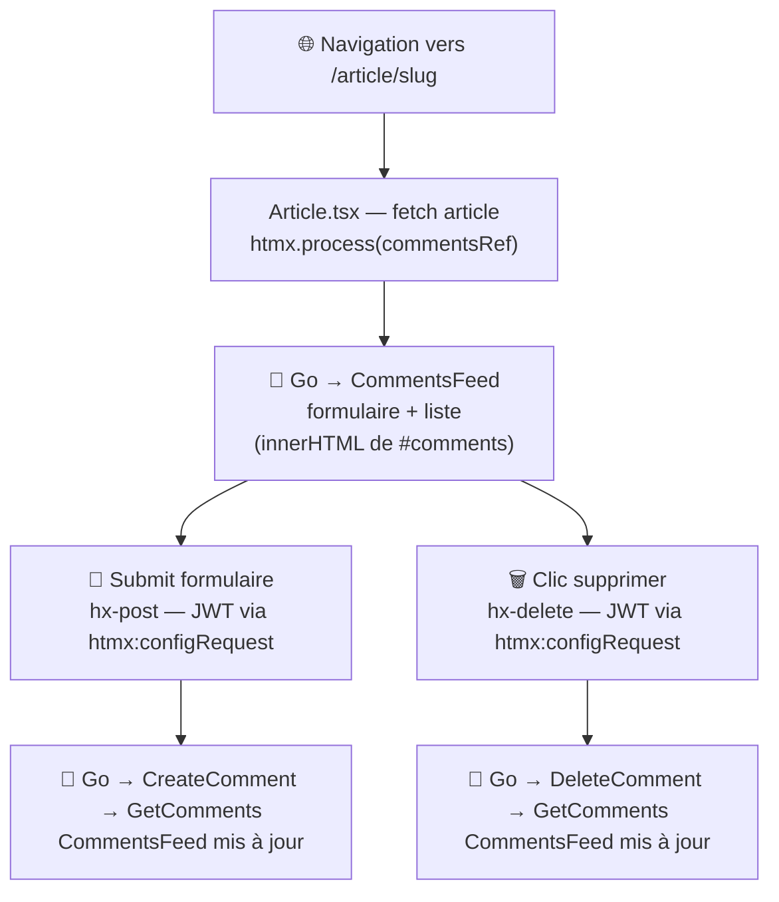

# MIGRATION_STEP.md — step-04-comments

## Nom de la branche

`step-04-comments`

---

## Objectif du step

Migrer la **section commentaires** de la page article (`/article/:slug`) vers un fragment HTML
servi par le backend Go : formulaire d'ajout, liste de commentaires, bouton de suppression.

Ce step introduit les **opérations d'écriture via HTMX** (`hx-post`, `hx-delete`) — les trois
steps précédents n'utilisaient que `hx-get`. Il introduit également la **propagation du JWT**
depuis la SPA Preact vers le backend Go via le hook `htmx:configRequest`, sans jamais exposer
le token dans le DOM.

Le corps de l'article et les métadonnées (`ArticleMeta`) restent intentionnellement en Preact :
ils nécessitent un rendu Markdown et des interactions (favorite, follow) liées à l'authentification.

---

## Différence avec step-03

| | step-03-profile | step-04-comments |
|---|---|---|
| Commentaires (liste) | Rendu Preact (`{comments.map(...)}`) | Fragment HTML Go |
| Formulaire ajout commentaire | Preact (`onSubmit → apiCreateComment`) | `hx-post` Go |
| Bouton supprimer | Preact (`onClick → apiDeleteComment`) | `hx-delete` Go |
| States dans Article.tsx | 4 (article, comments, commentBody, isLoading) | 2 (article, isLoading) |
| JWT transmis à Go | — | `htmx:configRequest` — lu en mémoire Zustand, jamais dans le DOM |
| Verbes HTTP HTMX | GET uniquement | GET + POST + DELETE |

---

## Nouveau concept : `htmx:configRequest` — JWT depuis Zustand sans toucher le DOM

HTMX déclenche un événement `htmx:configRequest` juste avant chaque requête. Son `detail.headers`
est modifiable — c'est le point d'injection idéal pour un header d'authentification.

Zustand expose `getState()` utilisable hors composant React, ce qui permet de lire le token
en mémoire au moment exact de l'envoi :

```ts
// index.tsx — une seule fois, couvre tous les fragments HTMX de l'app
document.addEventListener('htmx:configRequest', (e) => {
  const token = useStore.getState().user?.token;
  if (token) {
    e.detail.headers['Authorization'] = `Token ${token}`;
  }
});
```

**Pourquoi c'est mieux que `hx-headers` dans le DOM :**

| Approche | Token visible dans DevTools (Elements) | Token lisible par JS |
|---|---|---|
| `hx-headers='{"Authorization":"Token xxx"}'` | **Oui** | Oui |
| `htmx:configRequest` | **Non** | Oui (mémoire Zustand) |

Le token reste en mémoire JS (store Zustand), exactement là où il était. Il n'est jamais
sérialisé dans un attribut HTML.

---

## Architecture de communication

```
index.tsx — listener global htmx:configRequest
│   useStore.getState().user?.token  ← mémoire Zustand
│   e.detail.headers['Authorization'] = 'Token xxx'
│
└── intercepte toutes les requêtes HTMX de l'app :
    ├── GET  /hda/articles/:slug/comments  (chargement initial)
    ├── POST /hda/articles/:slug/comments  (ajout commentaire)
    └── DELETE /hda/articles/:slug/comments/:id  (suppression)

Article.tsx
└── <div id="comments"
         hx-get="/hda/articles/{slug}/comments?username=...&userImage=..."
         hx-trigger="load"
         hx-swap="innerHTML">          ← pas de hx-headers ici
```

**Pourquoi `innerHTML` ?**

Après un POST ou DELETE, Go re-rend le fragment complet (liste + formulaire).
Avec `innerHTML`, le div `#comments` reste dans le DOM entre les réponses —
HTMX peut toujours cibler `#comments` comme conteneur stable.

---

## Routes Go ajoutées

| Verbe | Route | Handler |
|---|---|---|
| GET | `/hda/articles/:slug/comments` | `CommentsHandler` |
| POST | `/hda/articles/:slug/comments` | `CreateCommentHandler` |
| DELETE | `/hda/articles/:slug/comments/:id` | `DeleteCommentHandler` |

---

## Propagation du username après POST/DELETE

Go doit connaître l'utilisateur connecté pour :
1. Afficher le formulaire (si authentifié)
2. Afficher le bouton supprimer (si auteur du commentaire)

Le JWT ne peut pas être décodé côté Go sans bibliothèque JWT. Solution simple :

- Chargement initial : `username` et `userImage` passés en **query params**
- POST : `username` et `userImage` en **hidden fields** dans le formulaire
- DELETE : `username` via **`hx-vals`** sur le bouton

Après chaque mutation, Go re-fetch les commentaires et re-rend `CommentsFeed` avec les bons paramètres.

---

## Diff Preact

### `index.tsx` — listener global ajouté

```diff
+// Injecte le JWT Zustand dans chaque requête HTMX, sans exposer le token dans le DOM.
+document.addEventListener('htmx:configRequest', (e) => {
+  const token = useStore.getState().user?.token;
+  if (token) {
+    e.detail.headers['Authorization'] = `Token ${token}`;
+  }
+});

 hydrate(<App />);
```

### `Article.tsx` — states 4→2, point de montage sans auth dans le DOM

```diff
-import { useEffect, useState } from 'preact/hooks';
+import { useEffect, useRef, useState } from 'preact/hooks';
-import { ArticleCommentCard } from '../components/ArticleCommentCard';
-import { apiCreateComment, apiGetComments } from '../services/api/comments';

 export default function ArticlePage(props) {
   const [article, setArticle] = useState(undefined);
-  const [comments, setComments] = useState([]);
-  const [commentBody, setCommentBody] = useState('');
   const [isLoading, setIsLoading] = useState(false);
+  const commentsRef = useRef(null);

-  const postComment = async (e) => { ... };
-  useEffect(() => { setComments(await apiGetComments(slug)); }, [slug]);

+  useEffect(() => {
+    if (commentsRef.current) window.htmx.process(commentsRef.current);
+  }, [article]);

-  // Formulaire + {comments.map(comment => <ArticleCommentCard ... />)}
+  <div id="comments" ref={commentsRef}
+       hx-get={commentsUrl} hx-trigger="load" hx-swap="innerHTML" />
```

### `global.d.ts` — type `htmx:configRequest` ajouté

```diff
+interface HtmxConfigRequestDetail {
+  headers: Record<string, string>;
+  ...
+}
+interface DocumentEventMap {
+  'htmx:configRequest': CustomEvent<HtmxConfigRequestDetail>;
+}
```

---

## Fichiers modifiés / créés

| Fichier | Action |
|---|---|
| `go-hda-backend/internal/api/types.go` | ajout `Comment`, `CommentsResponse`, `CommentResponse` |
| `go-hda-backend/internal/api/comments.go` | créé — `GetComments`, `CreateComment`, `DeleteComment` |
| `go-hda-backend/internal/handlers/comments.go` | créé — 3 handlers GET/POST/DELETE |
| `go-hda-backend/internal/templates/comments.templ` | créé — `CommentsFeed`, `commentCard` |
| `go-hda-backend/internal/templates/comments_templ.go` | généré par `make templ` |
| `go-hda-backend/cmd/server/main.go` | 3 nouvelles routes |
| `preact-realworld-example-app/public/index.tsx` | listener `htmx:configRequest` global |
| `preact-realworld-example-app/public/pages/Article.tsx` | states 4→2, point de montage HTMX |
| `preact-realworld-example-app/public/types/global.d.ts` | type `HtmxConfigRequestDetail` |

### Non modifiés

- `go-hda-backend/internal/templates/articles.templ` — `articleCard` et `formatDate` réutilisés
- Corps de l'article et `ArticleMeta` — restent en Preact
- `presentation/` (règle absolue — jamais modifié dans une branche step-*)

---

## Architecture de communication après step-04



---

## Commandes de lancement

### Mode stack complète (Docker + Traefik) — recommandé

```bash
cd reverse-proxy
cp .env.example .env
docker compose up --build
```

Ouvrir : **http://localhost:1337**

### Mode développement (sans Docker)

```bash
# Terminal 1 — Backend Go
cd go-hda-backend && make dev

# Terminal 2 — SPA Preact
cd preact-realworld-example-app && npm ci && npm run start
```

---

## Commandes de vérification

```bash
# Build + vet Go
cd go-hda-backend && go build ./... && go vet ./...

# Tester les fragments manuellement (backend Go lancé)
curl http://localhost:3000/hda/tags
curl "http://localhost:3000/hda/articles?tab=global&page=1"
curl "http://localhost:3000/hda/articles/slug/comments"

# Vérifier que presentation/ n'est pas touché
git diff --name-only trunk...HEAD | grep presentation/ && echo "ERREUR" || echo "OK"
```

---

## Point narratif pour la démo

> *"Jusqu'ici on a fait que du GET — lire des données. Maintenant on passe à l'écriture.
> Sur la page article, la section commentaires : poster un commentaire, supprimer le sien.*
>
> *Le défi : les opérations d'écriture nécessitent le JWT de l'utilisateur. Mais ce JWT
> vit dans le store Zustand de Preact — en mémoire JavaScript. Comment le transmettre à
> HTMX sans l'exposer dans le DOM ?*
>
> *HTMX déclenche un événement `htmx:configRequest` juste avant chaque requête. On y
> branche un listener dans `index.tsx` — une seule ligne — qui lit le token depuis Zustand
> et l'injecte dans les headers. Le token ne touche jamais le DOM. Ça fonctionne pour
> tous les fragments HTMX de l'app, actuels et futurs, sans rien changer d'autre."*

---

## Limites connues

- **Bouton favorite (❤)** dans les cartes d'articles reste non fonctionnel (hérité de step-02).
- **"Your Feed"** sur Home reste hors périmètre.
- `Article.tsx` conserve l'appel API JSON (`apiGetArticle`) et le rendu Markdown.
- Aucun test automatisé pour le backend Go.

---

## Passer à l'étape suivante

### Sans mise

```bash
git checkout step-05-webcomponent
```

### Avec mise

```bash
mise run step 5
```
