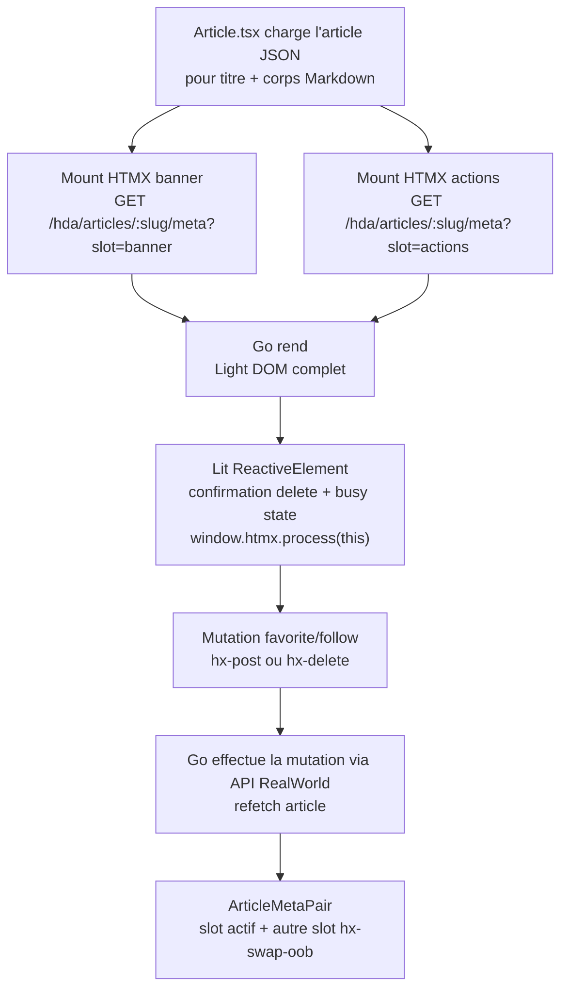

# MIGRATION_STEP.md — step-05-webcomponent

## Nom de la branche

`step-05-webcomponent`

---

## Objectif du step

Migrer **ArticleMeta** sur la page article (`/article/:slug`) vers un fragment HTML servi par Go et enrichi par un Web Component `<conduit-article-meta>` basé sur Lit.

Ce step conserve `Article.tsx` comme coquille SPA pour le routing, le chargement de l'article et le rendu Markdown du corps. Les deux occurrences d'ArticleMeta, dans la bannière et dans les actions sous l'article, deviennent des points de montage HTMX : Go rend le HTML complet, gère les mutations favorite/follow/delete, puis renvoie le nouvel état HTML.

Le point important du step : une mutation sur une occurrence synchronise l'autre occurrence via `hx-swap-oob`, sans état Preact partagé et sans exposer le JWT dans le DOM.

---

## Différence avec step-04

| | step-04-comments | step-05-webcomponent |
|---|---|---|
| ArticleMeta | Composant Preact local, dupliqué deux fois | Fragment Go `<conduit-article-meta>` chargé par HTMX |
| Favorite / unfavorite | Callback Preact + API JSON | `hx-post` / `hx-delete` vers Go |
| Follow / unfollow | Callback Preact + API JSON | `hx-post` / `hx-delete` vers Go |
| Delete article | Callback Preact + route SPA | `hx-delete`, puis header `HX-Redirect: /` |
| Synchronisation bannière/actions | Deux states Preact indépendants | Réponse HTML avec swap out-of-band |
| Enrichissement JS | Preact | Lit `ReactiveElement` sans Shadow DOM, Light DOM serveur préservé |
| JWT | Déjà injecté via `htmx:configRequest` | Même pont JWT, étendu aux mutations ArticleMeta |

---

## Architecture de communication



`Article.tsx` ne lit pas l'état JSON de l'article pour gérer favorite/follow. Il transmet seulement `currentUsername` en query param afin que Go rende les actions auteur/lecteur correctement. Le JWT reste lu en mémoire Zustand au moment de la requête par le listener global `htmx:configRequest`.

---

## Routes Go ajoutées

| Verbe | Route | Handler |
|---|---|---|
| GET | `/hda/articles/:slug/meta` | `ArticleMetaHandler` |
| POST | `/hda/articles/:slug/favorite` | `FavoriteArticleHandler` |
| DELETE | `/hda/articles/:slug/favorite` | `UnfavoriteArticleHandler` |
| POST | `/hda/profiles/:username/follow` | `FollowProfileHandler` |
| DELETE | `/hda/profiles/:username/follow` | `UnfollowProfileHandler` |
| DELETE | `/hda/articles/:slug` | `DeleteArticleHandler` |

Les mutations favorite/follow retournent un couple de fragments : le slot actif en réponse normale et l'autre slot en `hx-swap-oob="true"`. La suppression d'article retourne `HX-Redirect: /`.

---

## Fichiers et applications modifiés

| Fichier | Action |
|---|---|
| `go-hda-backend/internal/api/articles.go` | méthodes article/profile : get, favorite, unfavorite, delete, follow, unfollow |
| `go-hda-backend/internal/api/types.go` | ajout `ArticleResponse` |
| `go-hda-backend/internal/api/articles_test.go` | tests du client API article/profile |
| `go-hda-backend/internal/templates/article_meta.templ` | nouveau template `<conduit-article-meta>` + OOB pair |
| `go-hda-backend/internal/templates/article_meta_templ.go` | généré par `make templ` |
| `go-hda-backend/internal/templates/article_meta_test.go` | tests rendu auteur/lecteur/OOB/toggles DELETE |
| `go-hda-backend/internal/handlers/article_meta.go` | handlers HTMX de lecture et mutations |
| `go-hda-backend/internal/handlers/article_meta_test.go` | tests handlers avec fake client |
| `go-hda-backend/cmd/server/main.go` | routes step-05 |
| `preact-realworld-example-app/public/webcomponents/conduit-article-meta.ts` | Web Component Lit, Light DOM préservé |
| `preact-realworld-example-app/public/index.tsx` | import navigateur-only du Web Component |
| `preact-realworld-example-app/public/pages/Article.tsx` | remplacement des deux `ArticleMeta` par mounts HTMX |
| `preact-realworld-example-app/public/types/global.d.ts` | typings HTMX complémentaires |
| `preact-realworld-example-app/package.json` | dépendance directe `lit` |
| `preact-realworld-example-app/package-lock.json` | lock npm mis à jour |

`presentation/` n'est pas modifié par ce step.

---

## Commandes de lancement

### Stack complète — recommandé

```bash
cd reverse-proxy
cp .env.example .env
docker compose up --build
```

Ouvrir : **http://localhost:1337**

### Mode développement sans Docker

```bash
# Terminal 1 — Backend Go
cd go-hda-backend && make dev

# Terminal 2 — SPA Preact
cd preact-realworld-example-app && npm ci && npm run start
```

---

## Commandes de vérification

```bash
# Templates Go
cd go-hda-backend && make templ

# Tests backend
cd go-hda-backend && go test ./...

# Build + vet backend
cd go-hda-backend && go build ./... && go vet ./...

# Build SPA
cd preact-realworld-example-app && npm run build

# Règle absolue : aucune modification du deck
git diff --name-only step-04-comments...HEAD | grep presentation/ && echo "ERREUR" || echo "OK"
```

---

## Point narratif pour la démo

Ce step montre le moment où HTMX ne remplace plus seulement une liste ou un formulaire, mais une zone interactive riche qui existait deux fois dans la page.

Le message à faire passer :

1. Le serveur peut rendre un composant HTML complet, y compris les boutons d'action.
2. HTMX peut gérer les écritures et renvoyer le nouvel état HTML sans state frontend.
3. `hx-swap-oob` synchronise deux occurrences du même concept sans store client.
4. Lit peut enrichir le fragment serveur de comportements locaux, ici confirmation et busy state, sans reprendre la responsabilité du rendu.

Le Web Component n'est donc pas un retour à une SPA : il garde le Light DOM rendu par Go et ajoute seulement le comportement strictement local au navigateur.

---

## Limites connues et reste côté SPA

- `Article.tsx` charge encore l'article en JSON pour le titre, le corps Markdown et l'état de chargement.
- Le corps Markdown reste rendu côté Preact avec `snarkdown`.
- Les pages Editor, Settings, Auth et une partie des pages Profile restent SPA + API JSON.
- Le backend Go ne décode pas le JWT : il le propage à l'API RealWorld et reçoit `currentUsername` depuis la SPA pour le rendu conditionnel.
- La gestion fine des erreurs HTMX côté UI reste minimale : les handlers retournent des statuts HTTP simples.

---

## C'est la dernière étape

Vous avez parcouru toutes les étapes de la migration. Bravo !

Pour revenir à l'état initial :

### Sans mise

```bash
git checkout step-00-spa-json
```

### Avec mise

```bash
mise run step 0
```
