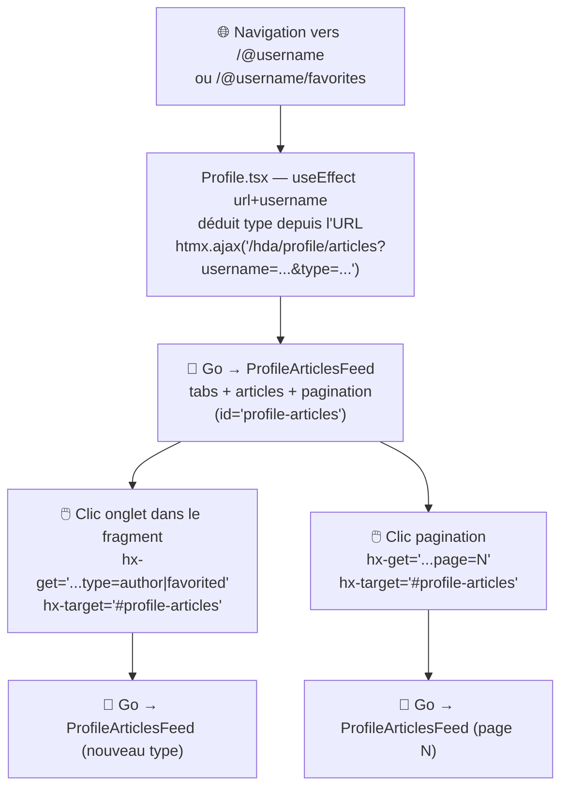

# MIGRATION_STEP.md — step-03-profile

## Nom de la branche

`step-03-profile`

---

## Objectif du step

Migrer la liste d'articles de la **page Profile** vers un fragment HTML servi par le backend Go :
**ProfileArticlesFeed** — onglets "My Articles" / "Favorited Articles" + liste + pagination.

Ce step introduit un nouveau pattern par rapport à step-02 : le fragment est paramétré par un **identifiant de ressource issu du routeur Preact** (le `username` et le type d'onglet déduit de l'URL). `Profile.tsx` sert de pont entre le routeur SPA et le fragment Go — il traduit les params de route en query params HTMX au moment du montage et à chaque changement d'URL.

Le **header de profil** (avatar, bio, bouton Follow/Unfollow) reste intentionnellement en Preact : il nécessite l'état d'authentification et des mutations API. Il sera l'objet d'un step ultérieur dédié à l'authentification côté serveur.

---

## Différence avec step-02

| | step-02-article-feed | step-03-profile |
|---|---|---|
| ArticleFeed (Home) | Fragment HTML Go | Fragment HTML Go (inchangé) |
| PopularTags (Home) | Fragment HTML Go | Fragment HTML Go (inchangé) |
| Articles de profil | Rendu Preact (useEffect + apiGetArticles) | Fragment HTML Go |
| Onglets profil (My Articles / Favorited) | Gérés par l'URL Preact-ISO + état | Rendus dans le fragment Go |
| Pagination profil | Composant Preact `<Pagination>` | Rendue dans le fragment Go |
| States dans Profile.tsx | 5 (user, articles, articlesCount, page, isLoading) | 1 (user — pour le header) |
| `useEffect` fetchArticles | Présent (appel API JSON) | Supprimé |
| Routeur Preact → Fragment Go | — | `useEffect([url, username])` → `htmx.ajax()` |
| Route Go ajoutée | — | `GET /hda/profile/articles?username&type&page` |
| Concept HTMX introduit | Fragment paramétré par état interne | Fragment paramétré par route externe |

---

## Dossiers et fichiers modifiés / créés

### Créés

```
go-hda-backend/
└── internal/
    ├── api/
    │   └── articles.go              ← ajout de GetProfileArticles(page, username, type)
    ├── handlers/
    │   └── profile_articles.go      ← ProfileArticlesHandler
    └── templates/
        ├── profile_articles.templ   ← template du fragment ProfileArticlesFeed
        └── profile_articles_templ.go ← généré par templ generate
```

### Modifiés

#### `go-hda-backend/internal/api/articles.go` — ajout de GetProfileArticles

```diff
+// GetProfileArticles retourne une page d'articles d'un profil.
+// articleType : "author" (articles écrits) ou "favorited" (articles favoris).
+func (c *Client) GetProfileArticles(page int, username, articleType string) ([]Article, int, error) {
+	offset := (page - 1) * ArticlePageLimit
+	path := fmt.Sprintf("/articles?limit=%d&offset=%d&%s=%s",
+		ArticlePageLimit, offset, articleType, url.QueryEscape(username))
+	var resp ArticlesResponse
+	if err := c.do("GET", path, nil, &resp); err != nil {
+		return nil, 0, err
+	}
+	return resp.Articles, resp.ArticlesCount, nil
+}
```

#### `go-hda-backend/cmd/server/main.go` — enregistrement de la route

```diff
 // step-02 : fil d'articles (Global Feed + Tag Feed + Pagination)
 e.GET("/hda/articles", handlers.ArticlesHandler)
+
+// step-03 : articles d'un profil (My Articles + Favorited Articles + Pagination)
+e.GET("/hda/profile/articles", handlers.ProfileArticlesHandler)
```

#### `public/pages/Profile.tsx` — simplification

```diff
-import { useEffect, useState } from 'preact/hooks';
+import { useEffect, useState } from 'preact/hooks';
 import { useLocation } from 'preact-iso';

-import { ArticlePreview } from '../components/ArticlePreview';
 import { Link } from '../components/Link';
-import { LoadingIndicator } from '../components/LoadingIndicator';
-import { Pagination } from '../components/Pagination';
-import { apiGetArticles } from '../services/api/article';
 import { apiFollowProfile, apiUnfollowProfile, apiGetProfile } from '../services/api/profile';

 export default function ProfilePage(props: ProfileProps) {
 	const username = props.params.username.replace(/^@/, '') || '';
 	const { url } = useLocation();
 	const [user, setUser] = useState({} as Profile);
-	const [articles, setArticles] = useState<Article[]>([]);
-	const [articlesCount, setArticlesCount] = useState(0);
-	const [page, setPage] = useState(1);
-	const [isLoading, setIsLoading] = useState(false);

-	useEffect(() => {
-		(async function fetchArticles() {
-			setIsLoading(true);
-			const { articles, articlesCount } = await apiGetArticles(page, {
-				[/.*\/favorites/g.test(url) ? 'favorited' : 'author']: username
-			});
-			setArticles(articles);
-			setArticlesCount(articlesCount);
-			setIsLoading(false);
-		})();
-	}, [url, page, username]);

+	// Pont routeur Preact → fragment Go
+	useEffect(() => {
+		const type = /.*\/favorites/.test(url) ? 'favorited' : 'author';
+		window.htmx.ajax(
+			'GET',
+			`/hda/profile/articles?username=${encodeURIComponent(username)}&type=${type}&page=1`,
+			{ target: '#profile-articles', swap: 'outerHTML' }
+		);
+	}, [url, username]);

 	// ...

-					{isLoading ? (
-						<LoadingIndicator ... />
-					) : articles.length > 0 ? (
-						articles.map(article => <ArticlePreview key={article.slug} article={article} />)
-					) : (
-						<div class="article-preview">No articles are here... yet.</div>
-					)}
-					<Pagination count={articlesCount} page={page} setPage={setPage} />
+					<div id="profile-articles" />
```

### Non modifiés

- `go-hda-backend/internal/templates/articles.templ` — `articleCard` est réutilisé tel quel (même package Go)
- Header de `Profile.tsx` — avatar, bio, Follow/Unfollow restent Preact
- `presentation/` (règle absolue)

---

## Fragment HTML généré par Go

```go
// internal/templates/profile_articles.templ
templ ProfileArticlesFeed(articles []api.Article, username, articleType string, page, totalPages int) {
    <div id="profile-articles">
        <div class="articles-toggle">
            <ul class="nav nav-pills outline-active">
                <li class="nav-item">
                    <a class="nav-link [active si author]"
                       hx-get="/hda/profile/articles?username=...&type=author&page=1"
                       hx-target="#profile-articles" hx-swap="outerHTML">My Articles</a>
                </li>
                <li class="nav-item">
                    <a class="nav-link [active si favorited]"
                       hx-get="/hda/profile/articles?username=...&type=favorited&page=1"
                       hx-target="#profile-articles" hx-swap="outerHTML">Favorited Articles</a>
                </li>
            </ul>
        </div>
        // articles (réutilise articleCard de articles.templ, même package Go)
        // pagination
    </div>
}
```

`articleCard` est défini dans `articles.templ` (privé, même package `templates`) et réutilisé directement dans `profile_articles.templ` sans duplication ni export.

---

## Architecture de communication après step-03



**Pourquoi `htmx.ajax()` plutôt que `hx-trigger="load"` ?**

`Profile.tsx` doit réagir à deux déclencheurs : le montage initial ET les changements d'URL (`/@username` ↔ `/@username/favorites`). Un `useEffect([url, username])` avec `htmx.ajax()` couvre les deux cas en une seule déclaration.

De plus, le type d'onglet initial dépend de l'URL Preact — cette logique doit rester en JavaScript. Le `useEffect` est le bon endroit pour traduire cette information en query param HTMX avant de déléguer au fragment Go.

---

## Commandes de lancement

### Mode stack complète (Docker + Traefik) — recommandé

```bash
cd reverse-proxy
cp .env.example .env
docker compose up --build
```

Ouvrir : **http://localhost:1337**

### Mode développement (sans Docker)

```bash
# Terminal 1 — Backend Go
cd go-hda-backend && make dev

# Terminal 2 — SPA Preact
cd preact-realworld-example-app && npm ci && npm run start
```

---

## Commandes de vérification

```bash
# Build + vet Go
cd go-hda-backend && go build ./... && go vet ./...

# Génération templ
cd go-hda-backend && make templ

# Build SPA
cd preact-realworld-example-app && npm run build

# Tester les fragments manuellement (backend Go lancé)
curl http://localhost:3000/hda/tags
curl "http://localhost:3000/hda/articles?tab=global&page=1"
curl "http://localhost:3000/hda/profile/articles?username=<un_username>&type=author&page=1"
curl "http://localhost:3000/hda/profile/articles?username=<un_username>&type=favorited&page=1"

# Vérifier que presentation/ n'est pas touché
git diff --name-only trunk...HEAD | grep presentation/ && echo "ERREUR" || echo "OK"
```

---

## Point narratif pour la démo

> *"On vient de faire la Home. Maintenant regardons une page différente : le profil d'un utilisateur. C'est la même mécanique — un fragment Go auto-rafraîchissant — mais avec une nouveauté : le fragment ne sait pas quel utilisateur afficher tout seul. C'est Preact qui le lui dit.*
>
> *Regardez Profile.tsx : il n'y a plus qu'un état, `user`, pour le header. Toute la logique articles est partie. À la place, un `useEffect` qui dit à HTMX : 'charge les articles de cet utilisateur, onglet auteur ou favoris selon l'URL'. Le fragment Go reçoit ces paramètres et se débrouille pour le reste — onglets, pagination, contenu.*
>
> *Ce qui reste en Preact, c'est intentionnel : le bouton Follow/Unfollow et le lien Edit Profile nécessitent de savoir qui est connecté. Ce sera l'objet d'un prochain step."*

---

## Limites connues et ce qui reste côté SPA

- **Header de profil** (Follow/Unfollow, Edit Settings) reste en Preact — nécessite auth.
- **Bouton favorite (❤)** dans les cartes d'articles reste non fonctionnel (hérité de step-02).
- **"Your Feed"** sur Home reste hors périmètre.
- `Profile.tsx` conserve un appel API JSON (`apiGetProfile`) pour alimenter le header.
- Aucun test automatisé pour le backend Go.

---

## Passer à l'étape suivante

### Sans mise

```bash
git checkout step-04-comments
```

### Avec mise

```bash
mise run step 4
```
