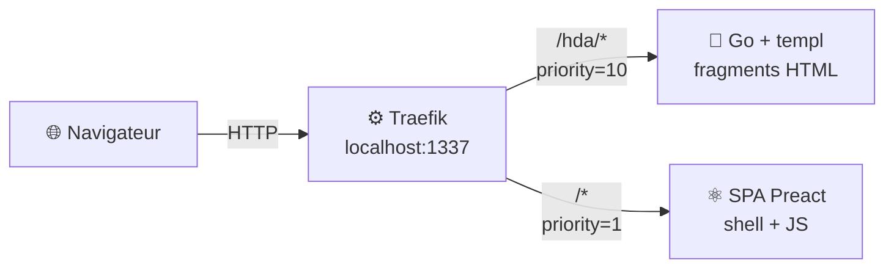
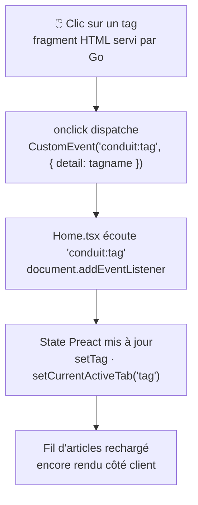

# À propos

Ce dépôt contient le code de la conférence-université **"HTMX, de manière simplix !"**

## Résumé

On a beaucoup parlé d'HTMX, maintenant il serait temps de s'y mettre. Et c'est exactement ce que Thomas et moi avons fait !
Nous nous sommes mis à la place d'une équipe technique qui décide d'effectuer une migration d'une application SPA vers une "Hypermedia Driven Application", grâce à [HTMX](https://htmx.org).

**À qui ça s'adresse :**
à quiconque s'intéresse au développement Web, aux frameworks frontend — ou au contraire à qui avait fait une croix là-dessus parce que "c'est devenu trop compliqué". Bonne nouvelle : non seulement ça ne l'est pas, mais en plus on va vous expliquer pourquoi !

---

## Vision de la migration

Le but n'est **pas** de tout réécrire d'un coup.

On part d'une SPA Preact existante ([RealWorld Conduit](https://realworld-docs.netlify.app/)) et on migre **un composant à la fois** vers une version HTML servie par un backend Go, enrichie avec HTMX.

### Principe clé : transparent pour l'utilisateur



- **Une seule URL** : `http://localhost:1337`.
- La SPA Preact reste le point d'entrée et continue de gérer le routing client-side.
- Au fil des étapes, des composants Preact sont remplacés par un simple point de montage HTMX :
  ```tsx
  // Avant — Preact gère tout
  <PopularTags onClick={setTag} />

  // Après — HTMX charge le fragment depuis Go
  <div hx-get="/hda/tags" hx-trigger="load" hx-swap="outerHTML" />
  ```
- Le résultat dans le DOM est identique. L'utilisateur ne voit aucune différence.
- La communication entre le HTML Go et le JS Preact restant se fait via des **événements DOM custom** — pas de couplage direct.

---

## Roadmap des étapes

Chaque branche `step-N-*` est construite sur la précédente et ne migre qu'un périmètre précis.

| Branche | Composant migré | Ce qu'on démontre |
|---------|----------------|-------------------|
| `step-00-spa-json` | *(aucun — état initial)* | La SPA Preact pure : tout dans le navigateur, échanges JSON |
| `step-01-go-hda-proxy` | **PopularTags** (sidebar des tags populaires) | Premier fragment HTML servi par Go ; infrastructure Traefik ; communication SPA ↔ HTMX via événement DOM |
| `step-02-*` et suivantes | À définir | Migration composant par composant |

> Les branches à partir de `step-02` ne sont pas encore figées.

---

## Prérequis

### Go 1.22+

```bash
go version   # doit afficher go1.22.x ou supérieur
# Installer : https://go.dev/dl/
```

### templ

Générateur de templates Go utilisé par `go-hda-backend/`.

```bash
go install github.com/a-h/templ/cmd/templ@latest
templ version   # v0.3.x ou supérieur

# Si templ n'est pas dans le PATH :
export PATH=$PATH:$(go env GOPATH)/bin
```

### Node.js 18+

```bash
node --version
npm --version
# Installer : https://nodejs.org/
```

### Docker + Docker Compose v2 *(requis pour step-01 et suivants)*

```bash
docker --version          # doit afficher Docker version 24+
docker compose version    # doit afficher Docker Compose version v2+
```

---

## Tester l'application

### `step-00-spa-json` — SPA Preact seule

```bash
git checkout step-00-spa-json
cd preact-realworld-example-app
npm ci
npm start
```

Ouvrir : **http://localhost:8080**

Toute la logique est dans le navigateur. L'application appelle directement `https://api.realworld.show/api`.
Aucun backend Go, aucun Traefik.

---

### `step-01-go-hda-proxy` — PopularTags migré vers Go + HTMX

```bash
git checkout step-01-go-hda-proxy
```

#### Ce qui a changé par rapport à step-00

| | step-00-spa-json | step-01-go-hda-proxy |
|---|---|---|
| PopularTags | Rendu côté client (Preact + fetch JSON) | Fragment HTML côté serveur (Go + templ) |
| Chargement des tags | `apiGetAllTags()` dans un `useEffect` | `hx-get="/hda/tags"` → backend Go |
| Communication avec la SPA | Callback `onClick` prop | Événement DOM custom `conduit:tag` |
| URL de l'application | `http://localhost:8080` | `http://localhost:1337` (via Traefik) |
| Reverse proxy | Aucun | Traefik sur `:1337` |

#### Mode stack complète (Docker + Traefik) — recommandé

```bash
cd reverse-proxy
cp .env.example .env
docker compose up --build
```

Ouvrir : **http://localhost:1337**

| URL | Service |
|-----|---------|
| **http://localhost:1337** | Application (SPA + fragments Go, URL unique) |
| http://localhost:8080 | Dashboard Traefik |

Pour vérifier que la migration fonctionne : ouvrez l'onglet **Réseau** du navigateur et rechargez la page. Vous verrez une requête `GET /hda/tags` qui retourne du **HTML**, pas du JSON. La sidebar des tags populaires est servie par Go.

#### Mode développement (sans Docker)

> ⚠️ En mode dev sans Traefik, le `hx-get="/hda/tags"` nécessite une configuration du proxy WMR
> pour rediriger `/hda/*` vers `localhost:3000`. Utiliser la stack Docker est plus simple.

**Terminal 1 — Backend Go :**
```bash
cd go-hda-backend
make dev   # génère les templates templ + démarre en mode watch sur :3000
```

**Terminal 2 — SPA Preact :**
```bash
cd preact-realworld-example-app
npm ci && npm start   # http://localhost:8080
```

---

## Commandes utiles

### Backend Go (`go-hda-backend/`)

```bash
make build   # compile le binaire
make run     # compile + démarre
make dev     # mode watch : templ --watch + go run (port 3000)
make templ   # régénère uniquement les *_templ.go
make vet     # go vet ./...
make clean   # supprime le binaire et les *_templ.go générés
```

### SPA Preact (`preact-realworld-example-app/`)

```bash
npm start       # serveur de développement (port 8080)
npm run build   # build de production dans dist/
```

---

## Structure du dépôt

```
.
├── preact-realworld-example-app/   # SPA Preact — modifiée progressivement
│   ├── public/
│   │   ├── index.html              #   charge HTMX via CDN (step-01+)
│   │   ├── components/
│   │   │   └── PopularTags.tsx     #   ← point de montage HTMX (step-01)
│   │   └── pages/
│   │       └── Home.tsx            #   écoute l'événement DOM conduit:tag (step-01)
│   └── Dockerfile                  #   build WMR + serve statique
├── go-hda-backend/                 # Backend Go — sert les fragments sur /hda/*
│   ├── cmd/server/main.go          #   serveur Echo, routes /hda/*
│   ├── Makefile
│   ├── Dockerfile
│   └── internal/
│       ├── api/                    #   client HTTP vers api.realworld.show
│       │   ├── client.go
│       │   ├── types.go
│       │   └── tags.go
│       ├── handlers/
│       │   └── tags.go             #   GET /hda/tags → fragment HTML
│       └── templates/
│           ├── tags.templ          #   template du fragment PopularTags
│           └── tags_templ.go       #   généré par templ generate
├── reverse-proxy/                  # Traefik — URL unique localhost:1337
│   ├── docker-compose.yml          #   Traefik + Go HDA + SPA, routing PathPrefix
│   ├── .env.example
│   └── traefik/
│       └── traefik.yml             #   entrypoint :1337, provider Docker
├── presentation/                   # Deck SliDesk — jamais touché dans step-*
├── AGENTS.md                       # Vision et règles du dépôt
├── MIGRATION_STEP.md               # Description du step courant
└── README.md
```

---

## Architecture de communication HTMX → SPA

Quand l'utilisateur clique un tag dans le fragment Go :



Ce pattern **découple le HTML Go du JS Preact** : ils ne se connaissent pas directement, ils communiquent via le DOM. C'est intentionnel et pédagogique.
