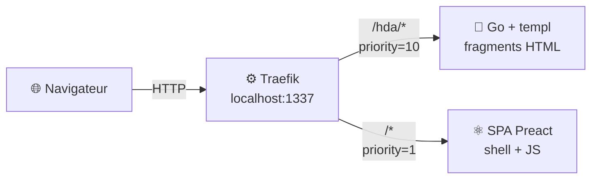
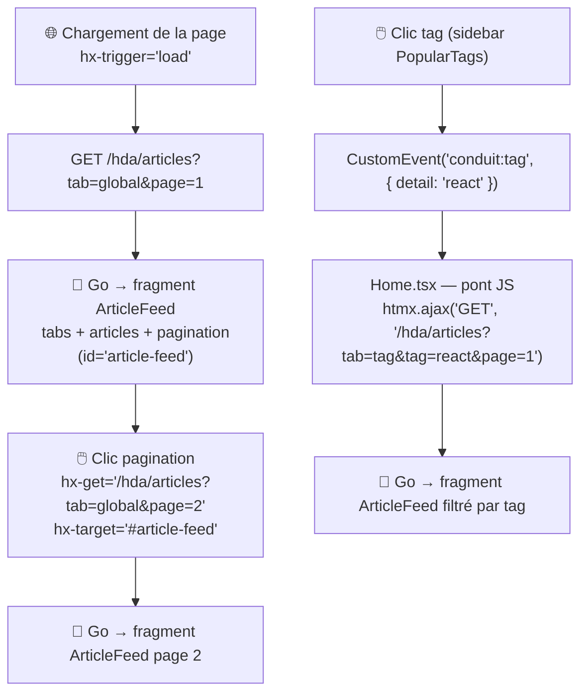
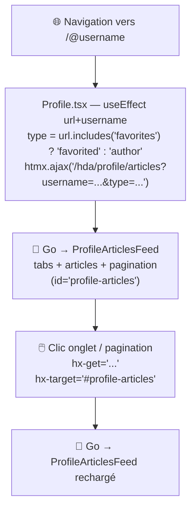
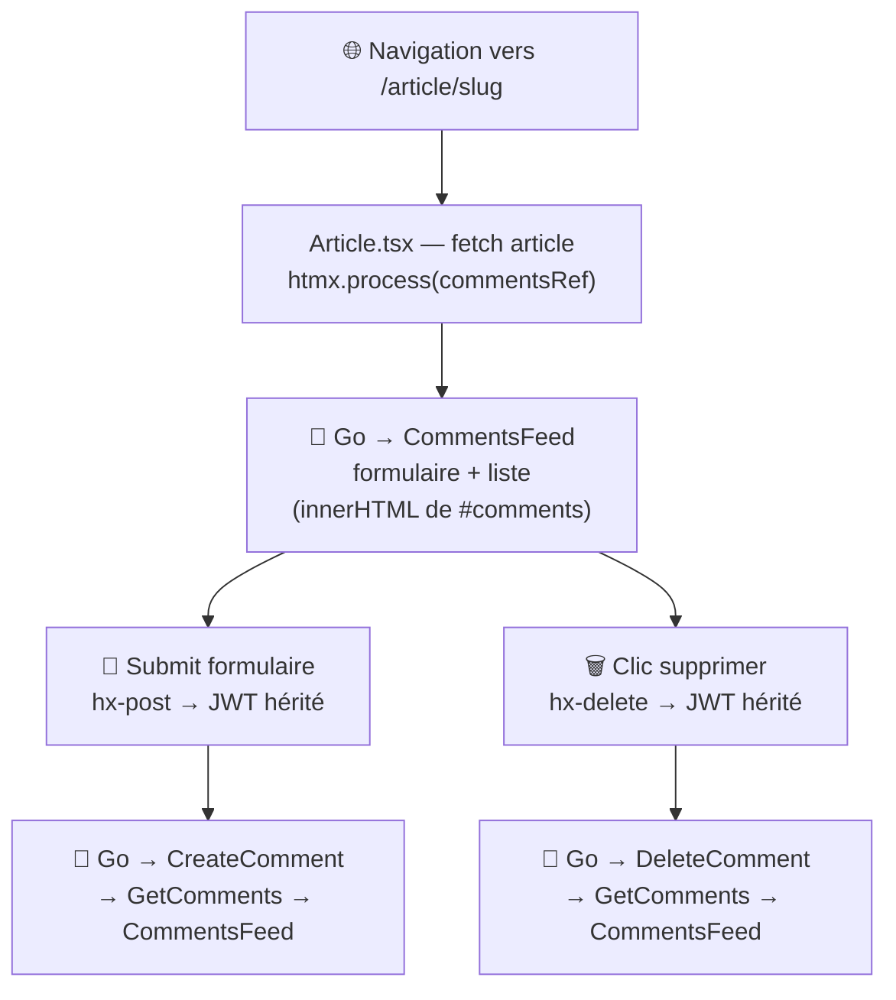
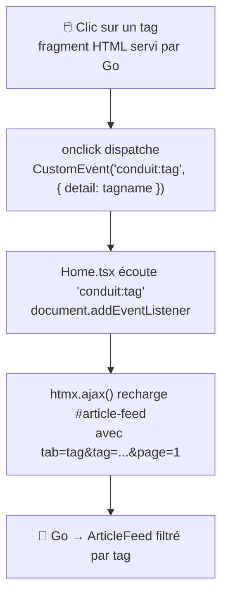
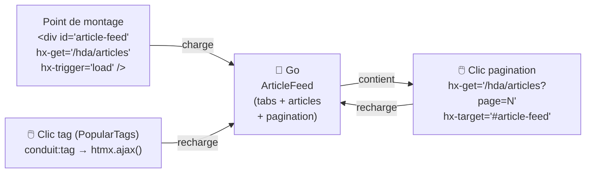

# À propos

Ce dépôt contient le code de la conférence-université **"HTMX, de manière simplix !"**

## Résumé

On a beaucoup parlé d'HTMX, maintenant il serait temps de s'y mettre. Et c'est exactement ce que Thomas et moi avons fait !
Nous nous sommes mis à la place d'une équipe technique qui décide d'effectuer une migration d'une application SPA vers une "Hypermedia Driven Application", grâce à [HTMX](https://htmx.org).

**À qui ça s'adresse :**
à quiconque s'intéresse au développement Web, aux frameworks frontend — ou au contraire à qui avait fait une croix là-dessus parce que "c'est devenu trop compliqué". Bonne nouvelle : non seulement ça ne l'est pas, mais en plus on va vous expliquer pourquoi !

---

## Vision de la migration

Le but n'est **pas** de tout réécrire d'un coup.

On part d'une SPA Preact existante ([RealWorld Conduit](https://realworld-docs.netlify.app/)) et on migre **un composant à la fois** vers une version HTML servie par un backend Go, enrichie avec HTMX.

### Principe clé : transparent pour l'utilisateur



- **Une seule URL** : `http://localhost:1337`.
- La SPA Preact reste le point d'entrée et continue de gérer le routing client-side.
- Au fil des étapes, des composants Preact sont remplacés par un simple point de montage HTMX :
  ```tsx
  // Avant — Preact gère tout
  <PopularTags onClick={setTag} />

  // Après — HTMX charge le fragment depuis Go
  <div hx-get="/hda/tags" hx-trigger="load" hx-swap="outerHTML" />
  ```
- Le résultat dans le DOM est identique. L'utilisateur ne voit aucune différence.
- La communication entre les fragments Go et le JS Preact restant se fait via des **événements DOM custom** — pas de couplage direct.

---

## Roadmap des étapes

Chaque branche `step-N-*` est construite sur la précédente et ne migre qu'un périmètre précis.

| Branche | Composant migré | Ce qu'on démontre |
|---------|----------------|-------------------|
| `step-00-spa-json` | *(aucun — état initial)* | La SPA Preact pure : tout dans le navigateur, échanges JSON |
| `step-01-go-hda-proxy` | **PopularTags** (sidebar des tags populaires) | Premier fragment HTML servi par Go ; infrastructure Traefik ; communication SPA ↔ HTMX via événement DOM |
| `step-02-article-feed` | **ArticleFeed** (fil d'articles + tabs + pagination) | Fragment paramétré et auto-rafraîchissant ; navigation sans JS ; pont événement DOM → `htmx.ajax()` |
| `step-03-profile` | **ProfileArticlesFeed** (articles d'un profil + tabs + pagination) | Fragment paramétré par un identifiant de route Preact ; routeur SPA → `htmx.ajax()` ; réutilisation de template Go entre pages |
| `step-04-comments` | **CommentsFeed** (commentaires d'un article : liste + ajout + suppression) | Premières **opérations d'écriture** (`hx-post`, `hx-delete`) ; JWT injecté via `htmx:configRequest` depuis Zustand — jamais exposé dans le DOM |

---

## Prérequis

### Sans mise

#### SliDesk *(présentation)*

Utilisé pour afficher le deck de conférence depuis `presentation/`.

- **Linux (Debian/Ubuntu)** : télécharger le `.deb` depuis [GitHub Releases](https://github.com/slidesk/slidesk/releases)
- **macOS** : `brew tap gouz/tools && brew install slidesk`

#### Go 1.24+

```bash
go version   # doit afficher go1.24.x ou supérieur
# Installer : https://go.dev/dl/
```

#### templ

Générateur de templates Go utilisé par `go-hda-backend/`.

```bash
go install github.com/a-h/templ/cmd/templ@latest
templ version   # v0.3.x ou supérieur

# Si templ n'est pas dans le PATH :
export PATH=$PATH:$(go env GOPATH)/bin
```

#### Node.js 24+

```bash
node --version
npm --version
# Installer : https://nodejs.org/
```

#### Docker + Docker Compose v2 *(requis pour step-01 et suivants)*

```bash
docker --version          # doit afficher Docker version 24+
docker compose version    # doit afficher Docker Compose version v2+
```

### Avec mise

[mise](https://mise.jdx.dev/) gère automatiquement Go, Node.js et templ.

```bash
mise install
```

> **SliDesk** et **Docker** doivent être installés séparément (voir ci-dessus).


---

## Afficher la présentation

Le deck de conférence se trouve dans `presentation/` et est servi par SliDesk sur le port 1338.

### Sans mise

```bash
cd presentation
slidesk
```

### Avec mise

```bash
mise run slides
```

Ouvrir : **http://localhost:1338**

---

## Tester l'application

### `step-00-spa-json` — SPA Preact seule

#### Sans mise

```bash
git checkout step-00-spa-json
cd preact-realworld-example-app
npm ci
npm run start
```

#### Avec mise

```bash
git checkout step-00-spa-json
mise install
mise run spa
```

Ouvrir : **http://localhost:8080**

Toute la logique est dans le navigateur. L'application appelle directement `https://api.realworld.show/api`.
Aucun backend Go, aucun Traefik.

---

### `step-01-go-hda-proxy` — PopularTags migré vers Go + HTMX

```bash
git checkout step-01-go-hda-proxy
```

#### Ce qui a changé par rapport à step-00

| | step-00-spa-json | step-01-go-hda-proxy |
|---|---|---|
| PopularTags | Rendu côté client (Preact + fetch JSON) | Fragment HTML côté serveur (Go + templ) |
| Chargement des tags | `apiGetAllTags()` dans un `useEffect` | `hx-get="/hda/tags"` → backend Go |
| Communication avec la SPA | Callback `onClick` prop | Événement DOM custom `conduit:tag` |
| URL de l'application | `http://localhost:8080` | `http://localhost:1337` (via Traefik) |
| Reverse proxy | Aucun | Traefik sur `:1337` |

#### Mode stack complète (Docker + Traefik) — recommandé

##### Sans mise

```bash
cd reverse-proxy
cp .env.example .env
docker compose up --build
```

##### Avec mise

```bash
cp reverse-proxy/.env.example reverse-proxy/.env
mise run stack
```

Ouvrir : **http://localhost:1337**

| URL | Service |
|-----|---------|
| **http://localhost:1337** | Application (SPA + fragments Go, URL unique) |
| http://localhost:8080 | Dashboard Traefik |

Pour vérifier que la migration fonctionne : ouvrez l'onglet **Réseau** du navigateur et rechargez la page. Vous verrez une requête `GET /hda/tags` qui retourne du **HTML**, pas du JSON. La sidebar des tags populaires est servie par Go.

#### Mode développement (sans Docker)

> ⚠️ En mode dev sans Traefik, le `hx-get="/hda/tags"` nécessite une configuration du proxy WMR
> pour rediriger `/hda/*` vers `localhost:3000`. Utiliser la stack Docker est plus simple.

##### Sans mise

**Terminal 1 — Backend Go :**
```bash
cd go-hda-backend
make dev   # génère les templates templ + démarre en mode watch sur :3000
```

**Terminal 2 — SPA Preact :**
```bash
cd preact-realworld-example-app
npm ci && npm run start   # http://localhost:8080
```

##### Avec mise

```bash
# Terminal 1 — Backend Go
mise run go:dev

# Terminal 2 — SPA Preact
mise run spa
```

---

### `step-02-article-feed` — fil d'articles migré vers Go + HTMX

```bash
git checkout step-02-article-feed
```

#### Ce qui a changé par rapport à step-01

| | step-01-go-hda-proxy | step-02-article-feed |
|---|---|---|
| PopularTags sidebar | Fragment HTML Go | Fragment HTML Go (inchangé) |
| Fil d'articles | Rendu Preact (useEffect + appel API JSON) | Fragment HTML Go |
| Pagination | Composant Preact `<Pagination>` | Rendue dans le fragment Go |
| Onglets (Global Feed / # tag) | Gérés par état Preact | Rendus dans le fragment Go |
| States dans Home.tsx | 6 (articles, articlesCount, isLoading, page, currentActiveTab, tag) | 1 (isAuthenticated) |
| `useEffect` fetchFeeds | Présent | Supprimé |
| `useEffect` conduit:tag | `setState` Preact | `htmx.ajax()` — pont 6 lignes |
| Route Go ajoutée | — | `GET /hda/articles?tab&tag&page` |

#### Concept introduit : fragment auto-rafraîchissant

En step-01, le fragment PopularTags était chargé une fois au montage et ne changeait plus.

En step-02, le fragment ArticleFeed se recharge lui-même : les boutons de pagination et les onglets de navigation contiennent leur propre `hx-get` qui remplace le fragment en place (`hx-swap="outerHTML"`). Le `id="article-feed"` est présent dans chaque réponse Go, ce qui permet à HTMX de toujours trouver la cible.



**Pourquoi un pont JS pour `conduit:tag` ?**

HTMX ne peut pas lire `event.detail` pour construire une URL dynamique. Les six lignes de `Home.tsx` servent de traducteur entre l'événement DOM (dispatché par le fragment PopularTags) et l'appel `htmx.ajax()` avec l'URL correcte. C'est le seul JavaScript qui reste pour gérer le fil d'articles.

**Pourquoi `htmx.process()` au montage du composant ?**

HTMX scanne les attributs `hx-*` au chargement initial de la page (`DOMContentLoaded`). Mais dans une SPA, quand l'utilisateur navigue vers `/article/xxx` puis revient sur `/`, Preact recrée le `<div id="article-feed" hx-trigger="load">` dans le DOM — HTMX ne le voit pas et `hx-trigger="load"` ne se déclenche jamais. Appeler `htmx.process(el)` dans le `useEffect` de montage résout ce problème : il signale à HTMX que cet élément doit être traité, ce qui déclenche immédiatement le `hx-get`.

#### Mode stack complète (Docker + Traefik) — recommandé

##### Sans mise

```bash
cd reverse-proxy
cp .env.example .env
docker compose up --build
```

##### Avec mise

```bash
cp reverse-proxy/.env.example reverse-proxy/.env
mise run stack
```

Ouvrir : **http://localhost:1337**

Pour vérifier la migration : onglet **Réseau** du navigateur → rechargez la page → vous verrez deux requêtes HTML :
- `GET /hda/tags` → sidebar des tags (step-01)
- `GET /hda/articles?tab=global&page=1` → fil d'articles (step-02)

Cliquez sur un bouton de pagination : nouvelle requête `GET /hda/articles?tab=global&page=N` — pas de JavaScript Preact impliqué.

Cliquez sur un tag dans la sidebar : requête `GET /hda/articles?tab=tag&tag=NOM_DU_TAG&page=1`.

---

### `step-03-profile` — articles de profil migrés vers Go + HTMX

```bash
git checkout step-03-profile
```

#### Ce qui a changé par rapport à step-02

| | step-02-article-feed | step-03-profile |
|---|---|---|
| Articles de profil | Rendu Preact (useEffect + apiGetArticles) | Fragment HTML Go |
| Onglets My Articles / Favorited | Gérés par URL Preact + état | Rendus dans le fragment Go |
| Pagination profil | Composant Preact `<Pagination>` | Rendue dans le fragment Go |
| States dans Profile.tsx | 5 | 1 (user — pour le header) |
| Route Go ajoutée | — | `GET /hda/profile/articles?username&type&page` |

#### Nouveau concept : fragment paramétré par une route Preact

En step-02, le fragment chargeait des paramètres issus d'un état interne (tag sélectionné, page).

En step-03, le fragment est paramétré par un **identifiant de ressource externe** : le `username` vient du routeur Preact (`/:username`), et le type d'onglet est déduit de l'URL (`/@username` vs `/@username/favorites`). `Profile.tsx` sert de pont :



#### Mode stack complète (Docker + Traefik) — recommandé

##### Sans mise

```bash
cd reverse-proxy
cp .env.example .env
docker compose up --build
```

##### Avec mise

```bash
cp reverse-proxy/.env.example reverse-proxy/.env
mise run stack
```

Ouvrir : **http://localhost:1337** puis naviguer vers le profil d'un utilisateur (cliquer sur un auteur d'article).

Pour vérifier la migration : onglet **Réseau** → naviguez vers un profil → vous verrez `GET /hda/profile/articles?username=...&type=author&page=1`. Cliquez sur "Favorited Articles" dans le fragment → nouvelle requête avec `type=favorited`, sans rechargement de page.

---

### `step-04-comments` — commentaires migrés vers Go + HTMX

```bash
git checkout step-04-comments
```

#### Ce qui a changé par rapport à step-03

| | step-03-profile | step-04-comments |
|---|---|---|
| Commentaires (liste) | Rendu Preact (`{comments.map(...)}`) | Fragment HTML Go |
| Formulaire ajout | Preact (`onSubmit → apiCreateComment`) | `hx-post` Go |
| Bouton supprimer | Preact (`onClick → apiDeleteComment`) | `hx-delete` Go |
| States dans Article.tsx | 4 (article, comments, commentBody, isLoading) | 2 (article, isLoading) |
| JWT transmis à Go | — | `hx-headers` injecté par Preact, hérité par form et boutons |
| Verbes HTTP HTMX | GET uniquement | GET + POST + DELETE |
| Routes Go ajoutées | — | `GET/POST /hda/articles/:slug/comments` + `DELETE /hda/articles/:slug/comments/:id` |

#### Nouveau concept : écriture via HTMX + propagation du JWT

Les trois steps précédents n'utilisaient que `hx-get`. Ce step introduit les mutations.

Le JWT vit dans le store Zustand de Preact. Il est injecté **une seule fois** sur le div conteneur via `hx-headers`. Tous les éléments Go à l'intérieur — le formulaire `hx-post`, les boutons `hx-delete` — l'héritent automatiquement.

La clé : `hx-swap="innerHTML"` au lieu de `outerHTML`. Avec `outerHTML`, le div disparaît à chaque réponse et emporte ses `hx-headers` avec lui. Avec `innerHTML`, il reste en place.



#### Mode stack complète (Docker + Traefik) — recommandé

##### Sans mise

```bash
cd reverse-proxy
cp .env.example .env
docker compose up --build
```

##### Avec mise

```bash
cp reverse-proxy/.env.example reverse-proxy/.env
mise run stack
```

Ouvrir : **http://localhost:1337** puis cliquer sur un article.

Pour vérifier la migration : onglet **Réseau** → ouvrez un article → vous verrez `GET /hda/articles/:slug/comments`. Postez un commentaire (connecté) → requête `POST /hda/articles/:slug/comments` avec l'header `Authorization: Token ...`. La liste se met à jour sans rechargement de page.

---

## Commandes utiles

### Backend Go (`go-hda-backend/`)

```bash
make build   # compile le binaire
make run     # compile + démarre
make dev     # mode watch : templ --watch + go run (port 3000)
make templ   # régénère uniquement les *_templ.go
make vet     # go vet ./...
make clean   # supprime le binaire et les *_templ.go générés
```

### SPA Preact (`preact-realworld-example-app/`)

```bash
npm run start   # serveur de développement (port 8080)
npm run build   # build de production dans dist/
```

---

## Structure du dépôt

```
.
├── preact-realworld-example-app/   # SPA Preact — modifiée progressivement
│   ├── public/
│   │   ├── index.html              #   charge HTMX via CDN (step-01+)
│   │   ├── components/
│   │   │   └── PopularTags.tsx     #   ← point de montage HTMX (step-01)
│   │   ├── pages/
│   │   │   ├── Home.tsx            #   pont conduit:tag → htmx.ajax() (step-02)
│   │   │   ├── Profile.tsx         #   pont routeur → htmx.ajax() (step-03)
│   │   │   └── Article.tsx         #   hx-headers JWT + point de montage comments (step-04)
│   │   └── types/
│   │       └── global.d.ts         #   types hx-*, window.htmx (step-01+)
│   └── Dockerfile                  #   build WMR + serve statique
├── go-hda-backend/                 # Backend Go — sert les fragments sur /hda/*
│   ├── cmd/server/main.go          #   serveur Echo, routes /hda/*
│   ├── Makefile
│   ├── Dockerfile
│   └── internal/
│       ├── api/                    #   client HTTP vers api.realworld.show
│       │   ├── client.go
│       │   ├── types.go            #   TagsResponse, Article, Author, Comment, ...
│       │   ├── tags.go             #   GetTags()
│       │   ├── articles.go         #   GetArticles + GetProfileArticles (step-02/03)
│       │   └── comments.go         #   GetComments, CreateComment, DeleteComment (step-04)
│       ├── handlers/
│       │   ├── tags.go             #   GET /hda/tags → fragment HTML
│       │   ├── articles.go         #   GET /hda/articles → fragment HTML (step-02)
│       │   ├── profile_articles.go #   GET /hda/profile/articles → fragment HTML (step-03)
│       │   └── comments.go         #   GET/POST/DELETE /hda/articles/:slug/comments (step-04)
│       └── templates/
│           ├── tags.templ          #   template du fragment PopularTags
│           ├── tags_templ.go       #   généré par templ generate
│           ├── articles.templ      #   template ArticleFeed + articleCard partagé (step-02)
│           ├── articles_templ.go   #   généré par templ generate
│           ├── profile_articles.templ     #   template ProfileArticlesFeed (step-03)
│           ├── profile_articles_templ.go  #   généré par templ generate
│           ├── comments.templ      #   template CommentsFeed + commentCard (step-04)
│           └── comments_templ.go   #   généré par templ generate
├── reverse-proxy/                  # Traefik — URL unique localhost:1337
│   ├── docker-compose.yml          #   Traefik + Go HDA + SPA, routing PathPrefix
│   ├── .env.example
│   └── traefik/
│       └── traefik.yml             #   entrypoint :1337, provider Docker
├── presentation/                   # Deck SliDesk — jamais touché dans step-*
├── AGENTS.md                       # Vision et règles du dépôt
├── MIGRATION_STEP.md               # Description du step courant
└── README.md
```

---

## Architecture de communication HTMX ↔ SPA

### step-01 : PopularTags (fragment sans paramètres)



### step-02 : ArticleFeed (fragment auto-rafraîchissant)



Ces deux patterns **découplent les fragments Go du JS Preact** : ils ne se connaissent pas directement, ils communiquent via le DOM et les attributs HTMX. C'est intentionnel et pédagogique.
