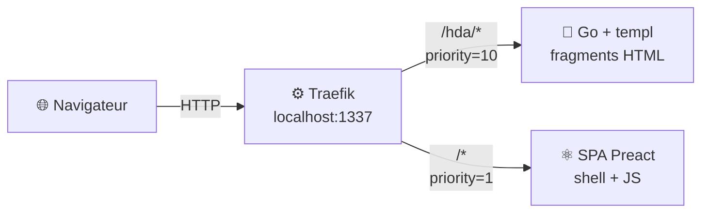
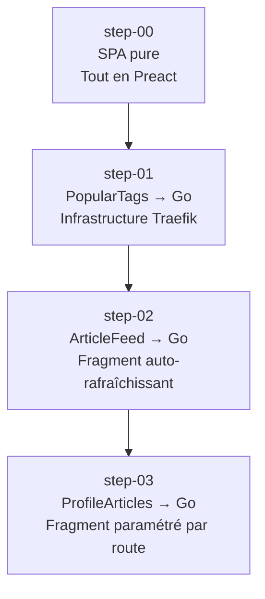
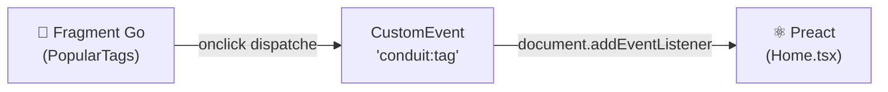
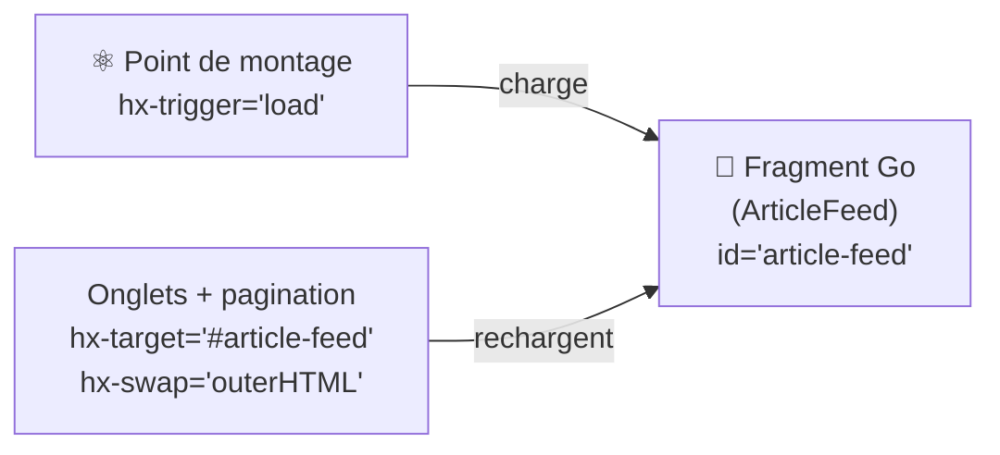
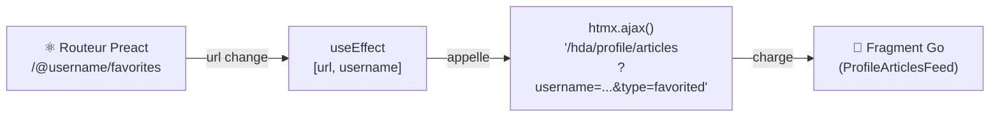

# À propos

Ce dépôt contient le code de la conférence-université **"HTMX, de manière simplix !"**

## Résumé

On a beaucoup parlé d'HTMX, maintenant il serait temps de s'y mettre. Et c'est exactement ce que Thomas et moi avons fait !
Nous nous sommes mis à la place d'une équipe technique qui décide d'effectuer une migration d'une application SPA vers une "Hypermedia Driven Application", grâce à [HTMX](https://htmx.org).

**À qui ça s'adresse :**
à quiconque s'intéresse au développement Web, aux frameworks frontend — ou au contraire à qui avait fait une croix là-dessus parce que "c'est devenu trop compliqué". Bonne nouvelle : non seulement ça ne l'est pas, mais en plus on va vous expliquer pourquoi !

---

## Vision de la migration

Le but n'est **pas** de tout réécrire d'un coup.

On part d'une SPA Preact existante ([RealWorld Conduit](https://realworld-docs.netlify.app/)) et on migre **un composant à la fois** vers une version HTML servie par un backend Go, enrichie avec HTMX.

### Principe clé : transparent pour l'utilisateur



- **Une seule URL** : `http://localhost:1337`.
- La SPA Preact reste le point d'entrée et continue de gérer le routing client-side.
- Au fil des étapes, des composants Preact sont remplacés par un simple point de montage HTMX :
  ```tsx
  // Avant — Preact gère tout
  <PopularTags onClick={setTag} />

  // Après — HTMX charge le fragment depuis Go
  <div hx-get="/hda/tags" hx-trigger="load" hx-swap="outerHTML" />
  ```
- Le résultat dans le DOM est identique. L'utilisateur ne voit aucune différence.
- La communication entre les fragments Go et le JS Preact restant se fait via des **événements DOM custom** ou des appels `htmx.ajax()` — pas de couplage direct.

---

## Roadmap des étapes

Chaque branche `step-N-*` est construite sur la précédente et ne migre qu'un périmètre précis.

| Branche | Composant migré | Concept clé introduit |
|---------|----------------|----------------------|
| `step-00-spa-json` | *(aucun — état initial)* | La SPA Preact pure : tout dans le navigateur, échanges JSON |
| `step-01-go-hda-proxy` | **PopularTags** — sidebar des tags | Infrastructure Traefik ; premier fragment Go ; communication via événement DOM custom |
| `step-02-article-feed` | **ArticleFeed** — fil d'articles + tabs + pagination | Fragment auto-rafraîchissant ; navigation sans JS ; `htmx.process()` pour SPA navigation |
| `step-03-profile` | **ProfileArticlesFeed** — articles de profil + tabs + pagination | Fragment paramétré par une route Preact ; routeur SPA → `htmx.ajax()` ; réutilisation de template Go |

### Progression de la migration



### Ce qui change à chaque step

| Composant / Zone | step-00 | step-01 | step-02 | step-03 |
|---|---|---|---|---|
| Popular Tags sidebar | Preact | **Go** | Go | Go |
| Article Feed (Home) | Preact | Preact | **Go** | Go |
| Pagination (Home) | Preact | Preact | **Go** | Go |
| Articles de profil | Preact | Preact | Preact | **Go** |
| Pagination (Profile) | Preact | Preact | Preact | **Go** |
| Header de profil | Preact | Preact | Preact | Preact |
| Page article + commentaires | Preact | Preact | Preact | Preact |
| Formulaires (auth, editor) | Preact | Preact | Preact | Preact |

---

## Patterns de communication SPA ↔ Go

Trois patterns émergent progressivement au fil des steps.

### Pattern 1 — Événement DOM custom (step-01)

Le fragment Go dispatche un événement, Preact l'écoute.



### Pattern 2 — Fragment auto-rafraîchissant (step-02)

Le fragment se recharge lui-même via `hx-get`. Preact n'intervient que pour l'initialisation.



### Pattern 3 — Route Preact → fragment Go (step-03)

Preact traduit les paramètres de route en query params HTMX.



---

## Prérequis

### Go 1.22+

```bash
go version   # doit afficher go1.22.x ou supérieur
# Installer : https://go.dev/dl/
```

### templ

Générateur de templates Go utilisé par `go-hda-backend/`.

```bash
go install github.com/a-h/templ/cmd/templ@latest
templ version   # v0.3.x ou supérieur

# Si templ n'est pas dans le PATH :
export PATH=$PATH:$(go env GOPATH)/bin
```

### Node.js 18+

```bash
node --version
npm --version
# Installer : https://nodejs.org/
```

### Docker + Docker Compose v2 *(requis pour step-01 et suivants)*

```bash
docker --version          # doit afficher Docker version 24+
docker compose version    # doit afficher Docker Compose version v2+
```

---

## Tester l'application

### `step-00-spa-json` — SPA Preact seule

```bash
git checkout step-00-spa-json
cd preact-realworld-example-app && npm ci && npm run start
```

Ouvrir : **http://localhost:8080**

Toute la logique est dans le navigateur. Aucun backend Go, aucun Traefik.

---

### `step-01-go-hda-proxy` — PopularTags → Go

```bash
git checkout step-01-go-hda-proxy
cd reverse-proxy && cp .env.example .env && docker compose up --build
```

Ouvrir : **http://localhost:1337**

**À observer :** onglet Réseau → `GET /hda/tags` retourne du HTML, pas du JSON. Cliquer sur un tag met à jour le fil d'articles via un événement DOM.

---

### `step-02-article-feed` — ArticleFeed → Go

```bash
git checkout step-02-article-feed
cd reverse-proxy && cp .env.example .env && docker compose up --build
```

Ouvrir : **http://localhost:1337**

**À observer :** `GET /hda/articles?tab=global&page=1` retourne du HTML. La pagination et les onglets rechargent le fragment sans JavaScript côté client.

---

### `step-03-profile` — ProfileArticles → Go

```bash
git checkout step-03-profile
cd reverse-proxy && cp .env.example .env && docker compose up --build
```

Ouvrir : **http://localhost:1337** → cliquer sur le nom d'un auteur d'article.

**À observer :** `GET /hda/profile/articles?username=...&type=author&page=1` retourne du HTML. Les onglets "My Articles" / "Favorited Articles" rechargent le fragment sans quitter la page.

---

## Commandes utiles

### Backend Go (`go-hda-backend/`)

```bash
make build   # compile le binaire
make run     # compile + démarre
make dev     # mode watch : templ --watch + go run (port 3000)
make templ   # régénère uniquement les *_templ.go
make vet     # go vet ./...
make clean   # supprime le binaire et les *_templ.go générés
```

### SPA Preact (`preact-realworld-example-app/`)

```bash
npm run start   # serveur de développement (port 8080)
npm run build   # build de production dans dist/
```

---

## Structure du dépôt

```
.
├── preact-realworld-example-app/   # SPA Preact — modifiée progressivement
│   ├── public/
│   │   ├── index.html              #   charge HTMX via CDN (step-01+)
│   │   ├── components/
│   │   │   └── PopularTags.tsx     #   point de montage HTMX (step-01)
│   │   ├── pages/
│   │   │   ├── Home.tsx            #   pont conduit:tag + htmx.ajax() (step-02)
│   │   │   └── Profile.tsx         #   pont routeur Preact → htmx.ajax() (step-03)
│   │   └── types/
│   │       └── global.d.ts         #   types hx-*, window.htmx
│   └── Dockerfile
├── go-hda-backend/                 # Backend Go — sert les fragments sur /hda/*
│   ├── cmd/server/main.go          #   serveur Echo, toutes les routes /hda/*
│   ├── Makefile
│   ├── Dockerfile
│   └── internal/
│       ├── api/
│       │   ├── client.go           #   client HTTP vers api.realworld.show
│       │   ├── types.go            #   types partagés (Article, Author, etc.)
│       │   ├── tags.go             #   GetTags()
│       │   └── articles.go         #   GetArticles() + GetProfileArticles()
│       ├── handlers/
│       │   ├── tags.go             #   GET /hda/tags
│       │   ├── articles.go         #   GET /hda/articles
│       │   └── profile_articles.go #   GET /hda/profile/articles
│       └── templates/
│           ├── tags.templ          #   PopularTags sidebar
│           ├── articles.templ      #   ArticleFeed + articleCard (réutilisé)
│           └── profile_articles.templ  #   ProfileArticlesFeed
├── reverse-proxy/                  # Traefik v3 — URL unique localhost:1337
│   ├── docker-compose.yml
│   ├── .env.example
│   └── traefik/traefik.yml
├── presentation/                   # Deck SliDesk — jamais modifié dans step-*
├── AGENTS.md                       # Vision et règles du dépôt
├── MIGRATION_STEP.md               # Description du step courant (par branche)
└── README.md                       # Ce fichier — introduction générale (trunk)
```
