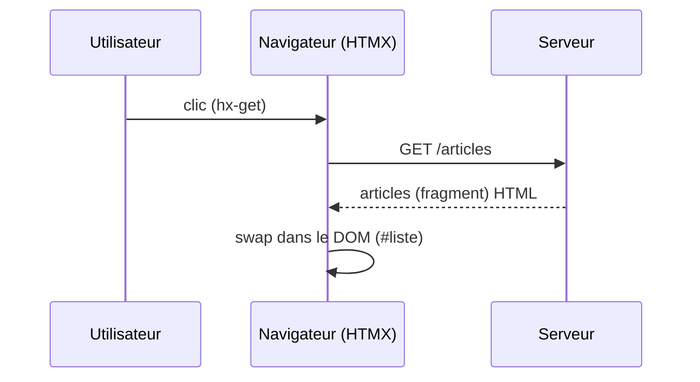

## .[chapter]

# Mais d'abord — HTMX, késaco ?

/*
Avant de plonger dans la migration, poser les bases pour que tout le monde soit au même niveau.
Même si une partie de l'audience connaît HTMX, ce chapitre fixe le vocabulaire qu'on utilisera pendant tout le talk.
*/

## L'idée centrale

- Des **attributs HTML** — pas du JavaScript écrit à la main
  - `hx-get`, `hx-post`, `hx-put`, `hx-delete`
  - `hx-target` : quelle zone remplacer dans le DOM
  - `hx-trigger` : quel événement déclenche la requête
- Le serveur répond avec du **HTML** — pas du JSON

/*
Une phrase suffit : HTMX étend le navigateur avec des attributs, il ne le remplace pas.
Un lien HTML fait déjà une requête GET et remplace toute la page. HTMX fait la même chose, mais ciblée sur une zone et sans recharger.
Le serveur ne sait pas qu'il parle à HTMX — il rend du HTML, point.
*/

## En pratique

```html
<!-- Le bouton déclenche la requête -->
<button hx-get="/articles" hx-target="#liste">
  Charger les articles
</button>

<!-- HTMX remplace le contenu de cette zone -->
<ul id="liste"></ul>
```

```html
<!-- Le serveur répond avec du HTML pur -->
<li>Article 1</li>
<li>Article 2</li>
```

/*
Lire le code à voix haute en deux temps : "le client dit quoi faire" / "le serveur répond avec quoi".
Aucun JavaScript écrit par le développeur. Zéro.
hx-target="#liste" : HTMX remplace le innerHTML de #liste avec la réponse.
Le serveur ne connaît pas HTMX — il rend juste du HTML partiel.
*/

## Le cycle HDA



/*
HDA : Hypermedia-Driven Application.
Le navigateur ne reconstruit plus l'interface à partir de données brutes — il reçoit le rendu final.
C'est le modèle original du Web, mais chirurgical : on ne recharge plus toute la page, on remplace juste la zone concernée.
Transition : "Voilà le cycle. Maintenant regardons comment ça change la donne par rapport à une SPA."
*/

## Ce que ça change

| | **SPA (JSON)** | **HDA (HTML)** |
|---|---|---|
| **Réponse serveur** | `{ "articles": [...] }` | `<ul><li>…</li></ul>` |
| **Rendu** | côté client (JS) | côté serveur |
| **État** | store JS | URL + DOM |
| **Diff/patch** | framework | HTMX swap |

/*
Ne pas présenter ça comme une victoire de l'un sur l'autre.
JSON est excellent pour une API partagée entre plusieurs clients (mobile, web, tiers).
HTML réduit la surface JS quand le seul client est le navigateur — c'est notre cas ici.
La migration qu'on va montrer ne choisit pas un camp : elle déplace la frontière là où c'est pertinent.
*/

## Ce qu'HTMX sait faire .[no-bullets compact]

- **hx-get** / **hx-post** / **hx-put** / **hx-patch** / **hx-delete**
- **hx-target** : cibler n'importe quel élément du DOM
- **hx-swap** : `innerHTML`, `outerHTML`, `beforebegin`, `afterend`, `prepend`, `append`…
- **hx-trigger** : `click`, `change`, `keyup`, `load`, `revealed`, `every 2s`…
- **hx-indicator** : afficher un spinner pendant la requête
- **hx-confirm** : demander confirmation avant d'envoyer
- **hx-include** : inclure d'autres champs dans la requête
- **hx-headers** : ajouter des headers HTTP personnalisés
- **hx-select** : n'extraire qu'une partie de la réponse HTML
- **hx-select-oob** : mettre à jour plusieurs zones en une seule réponse
- **hx-on** : écouter les événements du cycle HTMX (`htmx:afterRequest`, `htmx:beforeSwap`…)
- **hx-request** : configurer timeout, credentials, mode CORS
</br>
- Extensions : **websockets**, **SSE**, **preload**…

/*
Ne pas lire la liste — l'audience peut lire.
Pointer trois cas marquants : hx-trigger="load" qu'on va beaucoup utiliser, hx-swap="outerHTML" pour se remplacer soi-même, hx-select-oob pour mettre à jour plusieurs zones d'un coup.
Conclure : "On va en utiliser une poignée dans la démo — le reste existe si vous en avez besoin."
*/
