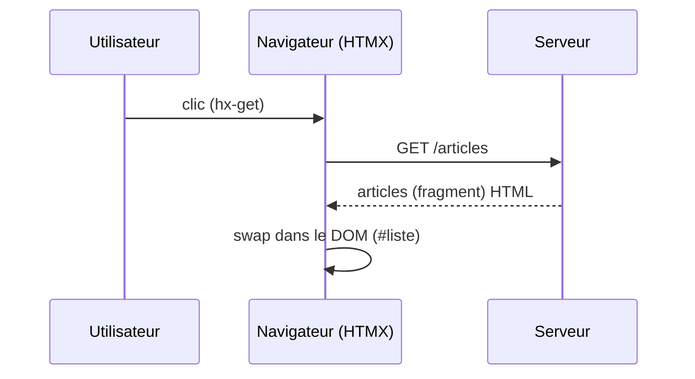

## .[chapter]

# HTMX, késaco?

## L'idée centrale

- Des **attributs HTML**, pas du JavaScript
- `hx-get`, `hx-post`, `hx-put`, `hx-delete`
- `hx-target` : quelle zone remplacer
- `hx-trigger` : quel événement déclenche la requête
- Le serveur répond avec du **HTML**, pas du JSON

/*
Partir de l'idée la plus simple possible : HTMX ne remplace pas le navigateur, il l'étend.
Un attribut `hx-get="/articles"` sur un bouton suffit pour déclencher une requête et remplacer une zone de la page.
Pas de composant, pas de store, pas de rendu côté client : juste un échange HTTP avec une réponse HTML.
C'est volontairement proche de ce que fait déjà un formulaire ou un lien, mais avec un contrôle plus fin sur la cible et le déclencheur.
*/

## En pratique

```html
<!-- Le bouton déclenche la requête -->
<button hx-get="/articles" hx-target="#liste">
  Charger les articles
</button>

<!-- HTMX remplace le contenu de cette zone -->
<ul id="liste"></ul>
```

```html
<!-- Le serveur répond avec du HTML pur -->
<li>Article 1</li>
<li>Article 2</li>
```

/*
Montrer les deux morceaux séparément : ce que le client envoie (via les attributs) et ce que le serveur renvoie.
Aucun JavaScript écrit par le développeur.
`hx-target` pointe vers `#liste` : HTMX remplace son contenu avec la réponse.
Le serveur ne sait pas qu'il parle à HTMX — il rend juste du HTML.
*/

## Le cycle HDA



/*
HDA : Hypermedia-Driven Application.
Le navigateur ne reconstruit plus l'interface à partir de données : il reçoit directement le rendu.
Le serveur reprend la responsabilité du rendu, le client reprend son rôle d'affichage.
Souligner que c'est le modèle original du Web, rendu plus précis : on ne recharge plus toute la page, on remplace juste la zone concernée.
*/

## Ce que ça change

| | SPA (JSON) | HDA (HTML) |
|---|---|---|
| Réponse serveur | `{ "articles": [...] }` | `<ul><li>...</li></ul>` |
| Rendu | côté client (JS) | côté serveur |
| État | store JS | URL + DOM |
| Diff/patch | framework | HTMX swap |

/*
Ne pas présenter ça comme une supériorité.
Le modèle JSON est excellent pour partager une API entre plusieurs clients.
Le modèle HTML réduit la surface JS pour les cas où le seul client est le navigateur.
La migration qu'on va présenter ne choisit pas un camp : elle déplace la frontière là où ça fait sens.
*/

## Ce qu'HTMX sait faire .[no-bullets]

- **hx-get** / **hx-post** / **hx-put** / **hx-patch** / **hx-delete**
- **hx-target** : cibler n'importe quel élément du DOM
- **hx-swap** : `innerHTML`, `outerHTML`, `beforebegin`, `afterend`, `prepend`, `append`, ...
- **hx-trigger** : `click`, `change`, `keyup`, `load`, `revealed`, `every 2s`, …
- **hx-indicator** : afficher un spinner pendant la requête
- **hx-confirm** : demander confirmation avant d'envoyer
- **hx-include** : inclure d'autres champs dans la requête
- **hx-headers** : ajouter des headers HTTP personnalisés
- **hx-select** : n'extraire qu'une partie de la réponse HTML
- **hx-select-oob** : swap de plusieurs zones en une seule réponse (out-of-band)
- **hx-on** : écouter les events HTMX (`htmx:afterRequest`, `htmx:beforeSwap`, …)
- **hx-request** : configurer timeout, credentials, mode CORS
</br>
</br>
- Extensions : **web-sockets**, **SSE**, ...

/*
Ne pas lire la liste.
L'objectif est de montrer l'étendue sans JavaScript applicatif.
Pointer quelques cas marquants tout de même
*/

