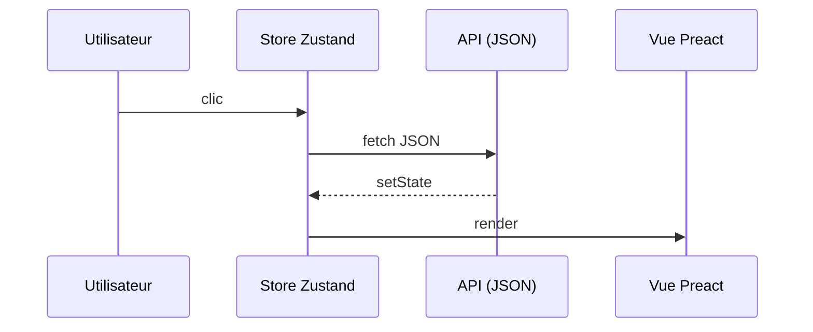

## .[chapter]

# Une SPA Preact — le point de départ

/*
On a vu HTMX dans l'abstrait. Maintenant on pose le contexte réel : quelle application, quel code, quels choix.
L'objectif de ce chapitre : montrer que RealWorld est plus riche qu'un exemple jouet, et que la SPA de départ est saine — pas une codebase catastrophique qu'on serait obligés de fuir.
*/

## RealWorld — le terrain de jeu

- Un clone de **Medium** — pas une todo-list
- Une **API commune** partagée entre des dizaines d'implémentations
- Des parcours CRUD complets : lire, écrire, commenter, favoriser, s'authentifier
- Notre point de départ : **preact-realworld-example-app**

/*
RealWorld est une suite d'applications de démonstration autour du même produit et de la même API.
Ce que ça nous apporte : on peut comparer deux stacks sans changer le domaine métier.
Insister sur le fait que l'implémentation Preact est propre et bien structurée — c'est important pour que la migration ne ressemble pas à un sauvetage.
*/

## Anatomie du point de départ

```text
public/
  pages/      → routes Preact (Home, Article, Profile…)
  components/ → composants UI (ArticlePreview, Pagination…)
  services/   → client JSON vers api.realworld.show
  store/      → état global (authentification Zustand)
```

/*
Orienter l'audience dans la codebase avant de plonger dans le code.
Home.tsx orchestre les onglets, la page courante, le tag actif, le chargement et les appels réseau.
PopularTags.tsx récupère les tags et passe un callback au parent pour filtrer les articles.
C'est une SPA classique, bien découpée — rien d'extraordinaire, et c'est justement le point.
*/

## Le cycle SPA classique



/*
Ne pas caricaturer ce modèle — il fonctionne bien.
Il est familier, testable, et les interactions locales y sont naturelles.
La question qu'on va poser : est-ce que ce travail de reconstruction du DOM à partir de JSON appartient toujours au client ?
Pour certaines zones, la réponse sera non.
*/

## La Home — une machine à états

```ts
// Home.tsx
const [articles, setArticles]           = useState<Article[]>([]);
const [articlesCount, setArticlesCount] = useState(0);
const [page, setPage]                   = useState(1);
const [currentActiveTab, setActiveTab]  = useState('global');
const [tag, setTag]                     = useState('');
const [isLoading, setIsLoading]         = useState(false);
```

**6 états** — pour afficher une liste d'articles avec pagination.

/*
Retenir ce chiffre : 6 states. On y reviendra.
Ce n'est pas une critique — c'est une observation. Ces 6 états servent essentiellement à projeter l'état du serveur côté client.
Chaque état introduit une surface de synchronisation : quand deux d'entre eux se désynchronisent, c'est un bug.
*/

## Le contrat réseau

```text
GET https://api.realworld.show/api/articles?limit=10&offset=0

→ {
    "articles": [{ "title": "…", "author": {…}, … }],
    "articlesCount": 42
  }
```

Le serveur envoie des **données brutes**.</br>
Preact construit le DOM — le serveur n'a jamais vu un `<li>`.

/*
Ce contrat JSON est excellent pour une API partagée entre plusieurs clients.
Mais dans notre cas, le seul client est le navigateur. Le JSON n'est pas l'interface finale : il faut encore le transformer en DOM, gérer l'état de chargement, orchestrer les mises à jour.
Transition : "Et si le serveur pouvait envoyer directement ce `<li>` ?"
*/

## Démo — step-00 : tout est JSON

DevTools → onglet **Réseau**

```text
← GET /api/tags           200  application/json
← GET /api/articles       200  application/json
← GET /api/articles?…     200  application/json
```

Chaque clic, chaque filtre, chaque changement de page → une requête JSON.</br>
Le serveur est **aveugle à l'interface**.

/*
Ouvrir l'application sur step-00 et montrer l'onglet Réseau en direct.
Faire défiler les pages, cliquer un tag : à chaque fois, une requête JSON.
Poser la question à voix haute : "Toutes ces données qui arrivent — qui les transforme en HTML ?"
Réponse : Preact, côté client, à chaque rendu.
C'est la dernière slide avant la migration — on commence à step-01 juste après.
*/
