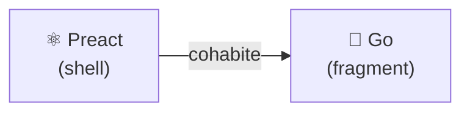
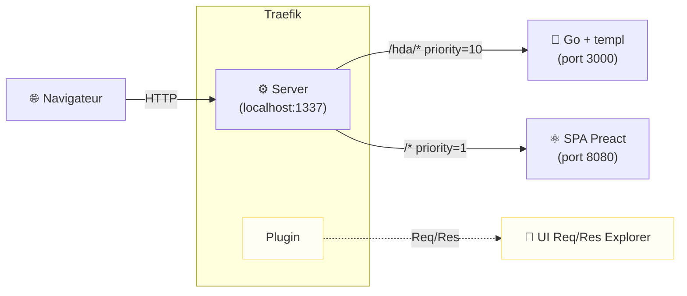

## Sans big bang .[chapter]
# De JSON à HTML

/*
On a vu la SPA de départ — propre, fonctionnelle, 6 states dans Home.tsx.
Ce chapitre raconte comment on l'a migrée, composant par composant, sans jamais casser l'application.
L'utilisateur n'a rien vu. Le code a changé. Voilà comment.
*/

## La stratégie : Strangler Fig



- Identifier une **zone de l'UI**
- Poser une **frontière HTTP claire**
- Remplacer **un composant**, pas l'application
- L'utilisateur ne voit **aucune différence**

/*
Le Strangler Fig (figuier étrangleur) : une plante qui pousse autour d'un arbre existant jusqu'à le remplacer complètement.
On n'arrête pas l'application pour la réécrire. On choisit une zone, on la remplace, on recommence.
À chaque step : l'application tourne, les tests passent, l'utilisateur ne voit rien.
*/

## L'infrastructure : une seule URL



Un seul point d'entrée. Deux backends. L'utilisateur ne voit pas la frontière.

/*
Traefik route par PathPrefix : /hda/… va vers Go, tout le reste vers la SPA.
Les deux routes matchent /hda/tags — la priorité explicite (10 vs 1) lève l'ambiguïté sans dépendre du comportement implicite de Traefik.
Pas de changement d'URL, pas d'entrée /etc/hosts, pas de CORS. La fondation invisible de toute la migration.
*/

## Résultat dans le navigateur

```text
← GET /              200  text/html     ← SPA Preact (shell)
← GET /hda/tags      200  text/html     ← Go (fragment)
← GET /hda/articles  200  text/html     ← Go (fragment)
```

Fini le JSON pour ces zones.</br>Le serveur répond avec **du HTML prêt à afficher**.

/*
Montrer l'onglet Réseau après step-01.
Contraste immédiat avec ce qu'on venait de voir : /api/… retournait du JSON, /hda/… retourne du HTML.
Le navigateur ne fait plus de transformation — il reçoit le rendu final et le colle dans le DOM.
*/
