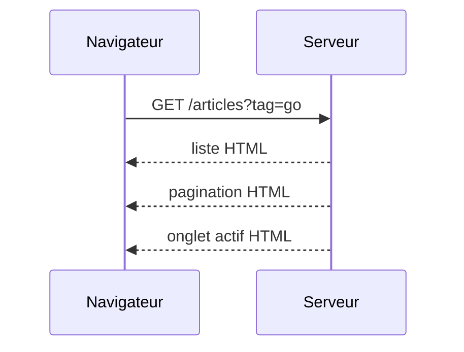
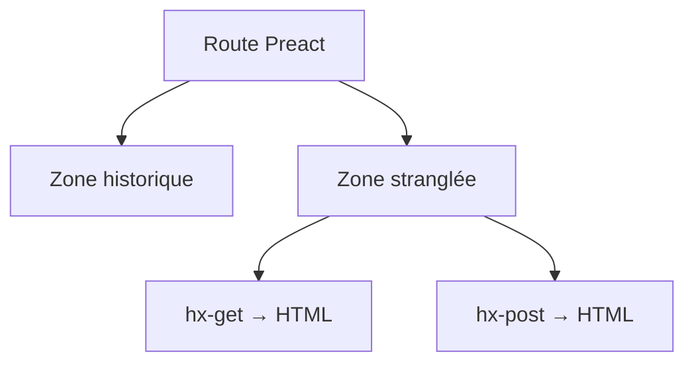

//@ < TBD

## .[chapter]

# De JSON à HTML, sans big bang

/*
Chapitre 2.
L'idée centrale: on ne jette pas Preact pour repartir de zéro.
On étrangle progressivement certaines branches de l'application en introduisant un backend Go qui sait rendre du HTML.
Le système doit rester utilisable pendant la migration.
*/

## La cible

```text
Preact shell
  + Go backend-for-front
  + fragments HTML
  + WebComponents SSR
  + HTMX pour les échanges
```

/*
Expliquer le terme "backend-for-front" dans notre contexte: un backend orienté interface web, qui parle au navigateur en HTML quand c'est utile.
Go rend les fragments et les WebComponents côté serveur.
Le navigateur reçoit du HTML déjà exploitable, puis HTMX prend en charge les requêtes AJAX déclaratives et les remplacements ciblés.
Preact peut continuer à exister autour ou à côté de ces zones.
*/

## Strangler fig

- Identifier une branche de l'UI
- Poser une frontière HTTP claire
- Servir JSON ou HTML selon le client
- Remplacer une zone, pas l'application

/*
Raconter la stratégie de migration progressive.
On garde l'application vivante et on choisit des zones: la liste d'articles, les tags populaires, le bouton favori, la pagination.
Le point important est la frontière: une route ou un endpoint peut continuer à servir du JSON à Preact et commencer à servir du HTML à HTMX.
Le nouveau système grandit autour de l'ancien jusqu'à ce que certaines branches Preact deviennent inutiles.
*/

## Le levier HTTP

```text
Accept: application/json  -> données pour Preact
Accept: text/html         -> fragment pour HTMX

Content-Type: application/json
Content-Type: text/html
```

/*
Le README du dépôt parle de jouer sur le Content-Type pour renvoyer soit du JSON, soit du HTML.
Dans la pratique, le couple intéressant est: la requête exprime ce qu'elle accepte, la réponse annonce ce qu'elle contient.
Ce levier permet de comparer les deux approches sur le même cas métier, sans devoir dupliquer tout le routage.
*/

## Premier candidat: lecture seule

- Tags populaires
- Liste d'articles
- Pagination

/*
Commencer par les zones avec peu ou pas de mutation.
`PopularTags` charge une liste puis déclenche un filtre.
`Pagination` ne fait que choisir une page.
La liste d'articles combine les deux.
Ce sont de bonnes premières migrations parce que les erreurs sont visibles, le rollback est simple, et la surface d'état est limitée.
*/

## Un composant devient un fragment

```text
ArticlePreview(article)
  Preact: props -> DOM
  Go:     data  -> HTML
```

/*
Souligner que le vocabulaire change moins qu'on ne le croit.
On garde l'idée de composant: une entrée, un rendu, un contrat.
La différence est l'endroit où le rendu a lieu.
Un composant Preact dépend d'un objet JSON et du runtime client.
Un fragment Go dépend de données serveur et produit directement le HTML attendu par le navigateur.
*/

## WebComponents SSR

- Balises métier stables
- HTML initial déjà utile
- Upgrade progressif côté navigateur
- JavaScript réservé au comportement local

/*
Préciser ce que l'on entend par WebComponents rendus côté serveur.
Le serveur peut envoyer des balises personnalisées avec leur contenu initial.
Le navigateur affiche déjà quelque chose, puis le custom element peut être chargé pour ajouter un comportement local.
Ce modèle nous aide à garder des frontières explicites: le serveur donne l'état initial, le composant client n'est pas obligé de refaire toute la récupération de données.
*/

## HTMX: l'interaction comme attribut

```html
<button
  hx-post="/articles/hello-world/favorite"
  hx-target="closest .article-preview"
  hx-swap="outerHTML">
  12
</button>
```

/*
Présenter HTMX comme un langage d'interaction HTTP dans le HTML.
Le bouton n'a pas besoin de savoir comment reconstruire toute la carte article.
Il dit quelle requête envoyer, quelle cible remplacer, et comment appliquer la réponse.
Le serveur devient responsable de renvoyer un fragment cohérent après la mutation.
*/

## Exemple: favori

```text
Avant: mutation -> JSON article -> setState
Après: mutation -> HTML article -> swap
```

/*
Reprendre `ArticlePreview`.
Avec Preact, le bouton favori met à jour un état local avec la réponse JSON.
Avec HTMX, l'action peut renvoyer le bouton ou la carte entière.
Le compromis se voit immédiatement: moins d'état client, mais une discipline plus forte sur la forme des fragments renvoyés.
*/

## Exemple: filtre par tag



/*
Le filtre par tag montre que la cible n'est pas toujours un petit bouton.
Quand l'utilisateur clique un tag, plusieurs zones peuvent changer: l'onglet actif, la liste, la pagination.
On doit décider si la réponse remplace seulement la liste ou un conteneur plus large.
Cette décision est l'équivalent HTMX d'une décision de découpage de composants.
*/

## Les difficultés rencontrées

- Qui possède l'état ?
- Qui possède l'URL ?
- Comment transporter le token ?
- Quelle cible remplacer ?
- Comment tester les fragments ?

/*
Ne pas vendre la migration comme gratuite.
L'état ne disparaît pas, il change de place.
L'URL doit rester partageable.
L'authentification doit fonctionner pour les appels HTMX.
Les fragments doivent être testables et cohérents.
Et il faut surveiller la duplication temporaire entre le rendu Preact et le rendu Go.
*/

## La cohabitation



/*
Insister sur le fait que la cohabitation est un état normal de la migration, pas un échec.
Pendant un moment, certaines routes restent pilotées par Preact, tandis que des morceaux de page se rechargent via HTMX.
Le rôle de l'équipe est de rendre cette cohabitation explicite: conventions de routes, conventions de fragments, conventions de tests, et critères de sortie.
*/
