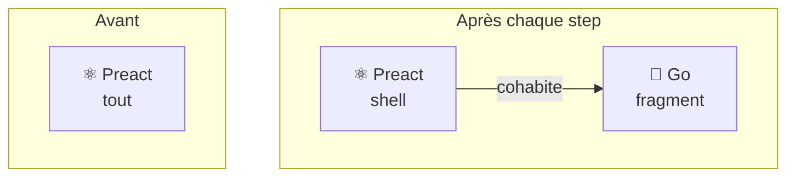
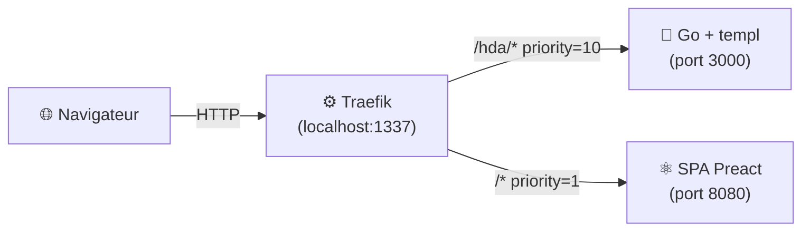
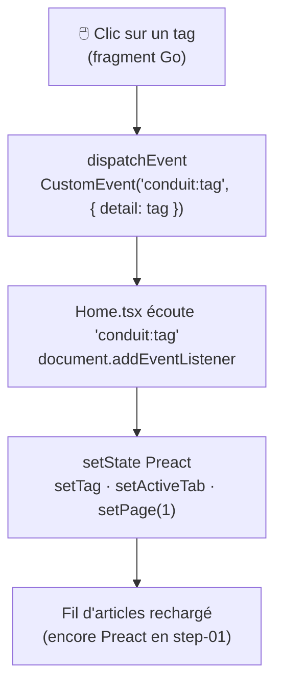
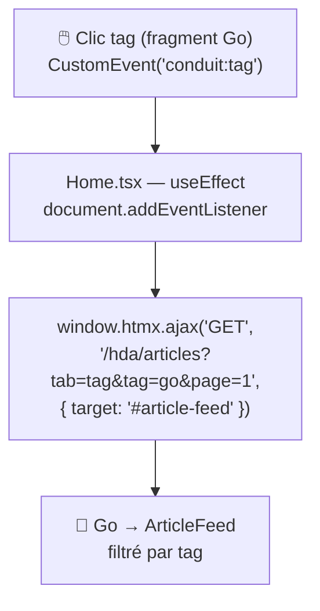
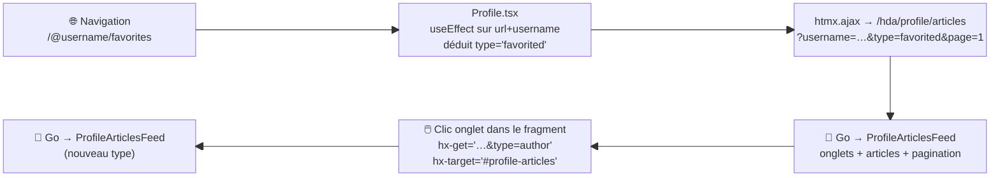
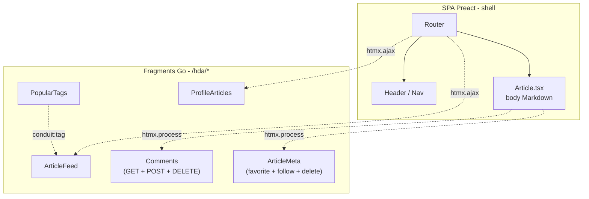

## Sans big bang .[chapter]
# De JSON à HTML

/*
On a vu la SPA de départ — propre, fonctionnelle, 6 states dans Home.tsx.
Ce chapitre raconte comment on l'a migrée, composant par composant, sans jamais casser l'application.
L'utilisateur n'a rien vu. Le code a changé. Voilà comment.
*/

## La stratégie : Strangler Fig



- Identifier une **zone de l'UI**
- Poser une **frontière HTTP claire**
- Remplacer **un composant**, pas l'application
- L'utilisateur ne voit **aucune différence**

/*
Le Strangler Fig (figuier étrangleur) : une plante qui pousse autour d'un arbre existant jusqu'à le remplacer complètement.
On n'arrête pas l'application pour la réécrire. On choisit une zone, on la remplace, on recommence.
À chaque step : l'application tourne, les tests passent, l'utilisateur ne voit rien.
*/

## L'infrastructure : une seule URL



Un seul point d'entrée. Deux backends. L'utilisateur ne voit pas la frontière.

/*
Traefik route par PathPrefix : /hda/… va vers Go, tout le reste vers la SPA.
Les deux routes matchent /hda/tags — la priorité explicite (10 vs 1) lève l'ambiguïté sans dépendre du comportement implicite de Traefik.
Pas de changement d'URL, pas d'entrée /etc/hosts, pas de CORS. La fondation invisible de toute la migration.
*/

## Résultat dans le navigateur

```text
← GET /              200  text/html     ← SPA Preact (shell)
← GET /hda/tags      200  text/html     ← Go (fragment)
← GET /hda/articles  200  text/html     ← Go (fragment)
```

Fini le JSON pour ces zones.</br>Le serveur répond avec **du HTML prêt à afficher**.

/*
Montrer l'onglet Réseau après step-01.
Contraste immédiat avec ce qu'on venait de voir : /api/… retournait du JSON, /hda/… retourne du HTML.
Le navigateur ne fait plus de transformation — il reçoit le rendu final et le colle dans le DOM.
*/

---

## Step-01 — PopularTags : le premier fragment

**Avant** — Preact gère le fetch, le loading, et passe un callback au parent :

```diff
- export function PopularTags({ onClick }) {
-   const [tags, setTags] = useState<string[]>([]);
-   const [loading, setLoading] = useState(false);
-   useEffect(() => { /* fetch JSON… */ }, []);
-   return <div class="sidebar">…{tags.map(tag => (
-     <a onClick={() => onClick(tag)}>{tag}</a>
-   ))}</div>;
- }
```

**Après** — un point de montage de 3 lignes :

```diff
+ export function PopularTags() {
+   return (
+     <div hx-get="/hda/tags" hx-trigger="load" hx-swap="outerHTML" />
+   );
+ }
```

/*
Diff le plus simple de toute la migration.
Toute la logique (fetch, state, loading, callback) disparaît côté client — elle est maintenant dans le backend Go.
hx-trigger="load" : HTMX charge le fragment dès que l'élément entre dans le DOM.
hx-swap="outerHTML" : le div se remplace lui-même par la réponse — l'élément Go prend sa place exacte dans l'arbre DOM.
*/

## Step-01 — Le fragment Go (templ)

```html
// internal/templates/tags.templ
templ TagsSidebar(tags []string) {
    <div class="sidebar">
        <p>Popular Tags</p>
        <div class="tag-list">
            for _, tag := range tags {
                <a class="tag-pill tag-default"
                   data-tag={ tag }
                   onclick="document.dispatchEvent(
                     new CustomEvent('conduit:tag', {
                       bubbles: true,
                       detail: this.dataset.tag
                     }))">
                   { tag }
                </a>
            }
        </div>
    </div>
}
```

`data-tag` + `this.dataset.tag` : la valeur du tag n'est **jamais interpolée dans une chaîne JS** → pas d'injection XSS.

/*
Deux points à souligner.
1. Le HTML produit est identique à ce que Preact générait — l'utilisateur ne voit rien.
2. Le pattern data-tag est une protection XSS : on ne construit pas onclick="...go('{tag}')" avec la valeur du tag dans la string JS. On lit this.dataset.tag au moment du clic, depuis l'attribut DOM.
*/

## Step-01 — Pattern 1 : CustomEvent DOM



Go et Preact **ne se connaissent pas** — ils communiquent via le DOM.

/*
Ce découplage est intentionnel.
Le fragment Go ne sait pas que Preact existe. Preact ne sait pas que le fragment vient de Go.
Ils parlent via un événement DOM standard — exactement comme deux bibliothèques indépendantes.
C'est ce qui rend la migration réversible : on peut remplacer un côté sans toucher l'autre.
*/

---

## Step-02 — ArticleFeed : l'état s'effondre

**Home.tsx avant (step-01) :**

```ts
const [articles, setArticles]           = useState<Article[]>([]);
const [articlesCount, setArticlesCount] = useState(0);
const [page, setPage]                   = useState(1);
const [currentActiveTab, setActiveTab]  = useState('global');
const [tag, setTag]                     = useState('');
const [isLoading, setIsLoading]         = useState(false);
// + useEffect + apiGetArticles + rendu JSX complet…
```

**Home.tsx après (step-02) :**

```ts
const isAuthenticated = useStore(state => !!state.user);
// c'est tout.
```

De **6 états** à **1** — sans changer une ligne visible pour l'utilisateur.

/*
C'est le chiffre le plus frappant de toute la migration.
Tout le code de fetch, d'orchestration et de rendu des articles a disparu côté client.
Il n'a pas été supprimé — il a été déplacé dans le fragment Go, là où il peut être rendu directement en HTML.
L'UX est identique. Rien n'a changé pour l'utilisateur.
*/

## Step-02 — Fragment auto-rafraîchissant

Le fragment Go contient **ses propres attributs HTMX** :

```html
<!-- Onglets — se rechargent eux-mêmes -->
<a hx-get="/hda/articles?tab=global&page=1"
   hx-target="#article-feed" hx-swap="outerHTML">
  Global Feed
</a>

<!-- Pagination — idem -->
<a hx-get="/hda/articles?tab=global&page=2"
   hx-target="#article-feed" hx-swap="outerHTML">
  2
</a>
```

Le fragment se remplace lui-même. **Zéro JavaScript** pour la navigation interne.

/*
Concept clé : un fragment peut porter ses propres déclencheurs.
Une fois monté dans le DOM, il n'a besoin de personne pour paginer ou changer d'onglet.
Avant : setPage, setActiveTab, useEffect — tout ça vivait dans Home.tsx.
Maintenant : ça vit dans le HTML lui-même, sous forme d'attributs déclaratifs.
*/

## Step-02 — Pattern 2 : htmx.ajax() comme pont



6 lignes de JavaScript — tout ce qui reste pour connecter les deux fragments.

/*
Pourquoi htmx.ajax() ici ? HTMX ne peut pas lire event.detail pour construire dynamiquement l'URL d'un hx-get.
Le pont JS est minimal et intentionnel : il traduit un événement DOM en appel HTMX avec le bon paramètre.
C'est le seul couplage JavaScript restant entre les deux fragments Go sur la Home.
*/

---

## Step-03 — Profile : pont routeur → fragment

`Profile.tsx` reçoit le `username` du routeur Preact et doit en déduire le type d'onglet depuis l'URL :

```ts
// Profile.tsx — tout ce qui reste pour les articles
useEffect(() => {
    const type = /.*\/favorites/.test(url) ? 'favorited' : 'author';
    window.htmx.ajax(
        'GET',
        `/hda/profile/articles?username=${encodeURIComponent(username)}&type=${type}&page=1`,
        { target: '#profile-articles', swap: 'outerHTML' }
    );
}, [url, username]);
```

De **5 états** à **1** (`user` — pour le header uniquement).

/*
Nouveau pattern : le fragment ne peut pas démarrer seul — il a besoin de paramètres que seul le routeur Preact connaît.
Le useEffect réagit aux changements d'URL ET de username : naviguer de /@alice vers /@alice/favorites recharge le fragment avec le bon type.
Après ce chargement initial, le fragment se débrouille seul pour les onglets, la pagination, le contenu.
*/

## Step-03 — Pattern 3 : routeur Preact → fragment



Preact gère l'URL. Go gère le contenu. **Frontière nette.**

/*
La séparation des responsabilités est claire et explicite.
Preact : routing, session, contexte utilisateur.
Go : rendu du contenu, onglets, pagination.
Le useEffect est le seul point de contact — un câble fin entre deux mondes indépendants.
*/

---

## Step-04 — Commentaires : les premières mutations

Les 3 premiers steps ne faisaient que du `hx-get`.
Step-04 introduit **l'écriture** avec `hx-post` et `hx-delete` :

```html
<!-- Formulaire d'ajout -->
<form hx-post="/hda/articles/{slug}/comments"
      hx-target="#comments" hx-swap="innerHTML">
    <textarea name="body"></textarea>
    <button type="submit">Post Comment</button>
</form>

<!-- Bouton supprimer -->
<button hx-delete="/hda/articles/{slug}/comments/{id}"
        hx-target="#comments" hx-swap="innerHTML">
    🗑
</button>
```

Après chaque mutation, Go re-rend **la liste entière** → toujours cohérente.

/*
La logique de "re-rendre la liste entière" mérite d'être explicitée.
C'est délibéré : le serveur est la source de vérité. Pas de patch client à maintenir, pas d'état intermédiaire fragile.
innerHTML ici (vs outerHTML pour les autres fragments) : le div #comments reste stable entre les réponses — HTMX peut toujours le cibler après un POST ou DELETE.
*/

## Step-04 — JWT sans toucher le DOM

**Problème :** HTMX doit authentifier ses requêtes, mais le token JWT vit dans Zustand (JS).

| Approche |&nbsp;| Token visible dans DevTools ? |
|---|---|---|
| `hx-headers='{"Authorization":"Token xxx"}'` || **Oui** ⚠️ (attribut HTML, DOM, logs…) |
| `htmx:configRequest` || **Non** ✅ (mémoire JS uniquement) |

```ts
// index.tsx — une seule fois, couvre toute l'app
document.addEventListener('htmx:configRequest', (e) => {
    const token = useStore.getState().user?.token;
    if (token) {
        e.detail.headers['Authorization'] = `Token ${token}`;
    }
});
```

/*
htmx:configRequest se déclenche juste avant chaque requête HTMX — c'est le point d'injection idéal.
hx-headers écrirait le token dans le DOM : visible dans l'inspecteur d'éléments, dans les logs, potentiellement dans des screenshots de support.
Ici le token reste en mémoire Zustand. Une seule ligne dans index.tsx couvre tous les fragments actuels et futurs.
*/

---

## Step-05 — ArticleMeta : une île réactive

ArticleMeta existait **deux fois** dans la page article :

- dans la bannière
- sous le corps de l'article

**Avant** — Preact gérait les callbacks `favorite`, `follow`, `delete`.

**Après** — deux points de montage HTMX :

```tsx
<div id="article-meta-banner"
     hx-get={articleMetaUrl('banner')}
     hx-trigger="load"
     hx-swap="outerHTML" />

<div id="article-meta-actions"
     hx-get={articleMetaUrl('actions')}
     hx-trigger="load"
     hx-swap="outerHTML" />
```

`Article.tsx` garde le routing et le Markdown. Go reprend les actions.

/*
Ce step est intéressant parce qu'on n'est plus sur une simple liste ou un formulaire.
ArticleMeta est une petite zone riche : identité auteur, boutons follow/favorite, édition ou suppression selon le contexte utilisateur.
Et surtout, elle existe deux fois dans la même page. Avant, Preact était le point naturel de synchronisation. Le step-05 enlève cette responsabilité du composant Preact.
*/

## WebComponent go brrr !

Go rend le HTML complet :

```html
<conduit-article-meta id="article-meta-banner" data-slot="banner">
  <div class="article-meta">
    …
    <button hx-post="/hda/articles/slug/favorite"
            hx-target="closest conduit-article-meta"
            hx-swap="outerHTML">
      Favorite Article
    </button>
  </div>
</conduit-article-meta>
```

Lit ajoute seulement le comportement local (en "light DOM") :

```ts
protected createRenderRoot() {
  return this; // pas de Shadow DOM
}
```

Le WebComponent **n'est pas la source du HTML**. Il enrichit le HTML serveur.

/*
Point important : ce n'est pas "HTMX partout, puis retour à une mini-SPA".
Le rendu reste côté Go. Le custom element garde le Light DOM, donc le HTML que Go envoie reste le HTML inspectable et échangeable par HTMX.
Lit sert ici à deux comportements locaux : confirmation avant delete et état busy pendant la requête. C'est une île de comportement, pas une île de rendu.
*/

## Synchroniser sans store client

Une mutation sur une occurrence renvoie **deux fragments** :

```go
templ ArticleMetaPair(article api.Article, activeSlot string, currentUsername string) {
    @ArticleMeta(article, activeSlot, currentUsername)
    @ArticleMetaOOB(article, otherArticleMetaSlot(activeSlot), currentUsername)
}
```

```html
<conduit-article-meta id="article-meta-actions" hx-swap-oob="true">
  …
</conduit-article-meta>
```

`hx-swap-oob` met à jour l'autre occurrence. Pas de state Preact partagé.

/*
Exemple à montrer en démo : cliquer Favorite en haut de l'article, et regarder le bouton du bas se synchroniser.
Le serveur fait la mutation, relit l'article, puis renvoie l'état complet des deux slots.
Le slot actif est remplacé par la réponse normale. L'autre slot est remplacé out-of-band grâce à son id.
La synchronisation vient du HTML retourné par le serveur, pas d'un store côté client.
*/

---

## Récapitulatif : 5 steps, 5 patterns

| Step |&nbsp;| Fragment migré | Ce qui est introduit |
|---|----|---|---|
| 01 || PopularTags | Fragment simple + `CustomEvent` DOM |
| 02 || ArticleFeed | Fragment auto-rafraîchissant + `htmx.ajax()` |
| 03 || ProfileArticles | Pont routeur Preact → fragment |
| 04 || Commentaires | `hx-post` / `hx-delete` + `htmx:configRequest` |
| 05 || ArticleMeta | Web Component Light DOM + `hx-swap-oob` |

/*
Chaque step introduit exactement un nouveau concept.
C'est volontaire : on voulait pouvoir montrer chaque pattern isolément, sans surcharge cognitive.
Ces 5 patterns couvrent l'essentiel des cas réels : lecture simple, lecture paramétrée, routing externe, mutation authentifiée, et synchronisation de zones interactives dupliquées.
*/

## La cohabitation



/*
Voilà l'état final après les 5 steps.
Preact reste le shell : routing, header, chargement de l'article et rendu Markdown.
Go couvre les listes, la pagination, les commentaires, et maintenant les actions ArticleMeta.
La cohabitation n'est pas un état d'échec — c'est le résultat voulu d'un strangler fig bien mené.
*/
