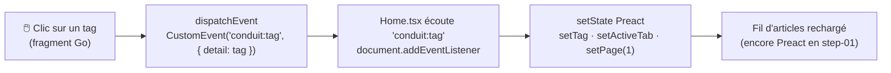

## Step-01 — PopularTags : le premier fragment .[chapter]

**Avant** — Preact gère le fetch, le loading, et passe un callback au parent :

```diff
- export function PopularTags({ onClick }) {
-   const [tags, setTags] = useState<string[]>([]);
-   const [loading, setLoading] = useState(false);
-   useEffect(() => { /* fetch JSON… */ }, []);
-   return <div class="sidebar">…{tags.map(tag => (
-     <a onClick={() => onClick(tag)}>{tag}</a>
-   ))}</div>;
- }
```

**Après** — un point de montage de 3 lignes :

```diff
+ export function PopularTags() {
+   return (
+     <div hx-get="/hda/tags" hx-trigger="load" hx-swap="outerHTML" />
+   );
+ }
```

/*
Diff le plus simple de toute la migration.
Toute la logique (fetch, state, loading, callback) disparaît côté client — elle est maintenant dans le backend Go.
hx-trigger="load" : HTMX charge le fragment dès que l'élément entre dans le DOM.
hx-swap="outerHTML" : le div se remplace lui-même par la réponse — l'élément Go prend sa place exacte dans l'arbre DOM.
*/

## Step-01 — Le fragment Go (templ)

```html
// internal/templates/tags.templ
templ TagsSidebar(tags []string) {
    <div class="sidebar">
        <p>Popular Tags</p>
        <div class="tag-list">
            for _, tag := range tags {
                <a class="tag-pill tag-default"
                   data-tag={ tag }
                   onclick="document.dispatchEvent(
                     new CustomEvent('conduit:tag', {
                       bubbles: true,
                       detail: this.dataset.tag
                     }))">
                   { tag }
                </a>
            }
        </div>
    </div>
}
```

`data-tag` + `this.dataset.tag` : la valeur du tag n'est **jamais interpolée dans une chaîne JS** → pas d'injection XSS.

/*
Deux points à souligner.
1. Le HTML produit est identique à ce que Preact générait — l'utilisateur ne voit rien.
2. Le pattern data-tag est une protection XSS : on ne construit pas onclick="...go('{tag}')" avec la valeur du tag dans la string JS. On lit this.dataset.tag au moment du clic, depuis l'attribut DOM.
*/

## Step-01 — CustomEvent DOM



Go et Preact **ne se connaissent pas** — ils communiquent via le DOM.

/*
Ce découplage est intentionnel.
Le fragment Go ne sait pas que Preact existe. Preact ne sait pas que le fragment vient de Go.
Ils parlent via un événement DOM standard — exactement comme deux bibliothèques indépendantes.
C'est ce qui rend la migration réversible : on peut remplacer un côté sans toucher l'autre.
*/
