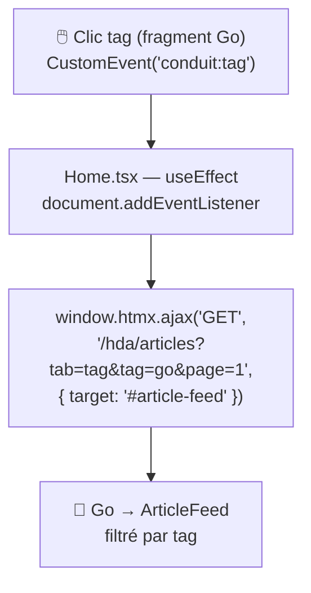

## Step-02 — ArticleFeed : l'état s'effondre .[chapter]

**Home.tsx avant (step-01) :**

```ts
const [articles, setArticles]           = useState<Article[]>([]);
const [articlesCount, setArticlesCount] = useState(0);
const [page, setPage]                   = useState(1);
const [currentActiveTab, setActiveTab]  = useState('global');
const [tag, setTag]                     = useState('');
const [isLoading, setIsLoading]         = useState(false);
// + useEffect + apiGetArticles + rendu JSX complet…
```

**Home.tsx après (step-02) :**

```ts
const isAuthenticated = useStore(state => !!state.user);
// c'est tout.
```

De **6 états** à **1** — sans changer une ligne visible pour l'utilisateur.

/*
C'est le chiffre le plus frappant de toute la migration.
Tout le code de fetch, d'orchestration et de rendu des articles a disparu côté client.
Il n'a pas été supprimé — il a été déplacé dans le fragment Go, là où il peut être rendu directement en HTML.
L'UX est identique. Rien n'a changé pour l'utilisateur.
*/

## Step-02 — Fragment auto-rafraîchissant

Le fragment Go contient **ses propres attributs HTMX** :

```html
<!-- Onglets — se rechargent eux-mêmes -->
<a hx-get="/hda/articles?tab=global&page=1"
   hx-target="#article-feed" hx-swap="outerHTML">
  Global Feed
</a>

<!-- Pagination — idem -->
<a hx-get="/hda/articles?tab=global&page=2"
   hx-target="#article-feed" hx-swap="outerHTML">
  2
</a>
```

Le fragment se remplace lui-même. **Zéro JavaScript** pour la navigation interne.

/*
Concept clé : un fragment peut porter ses propres déclencheurs.
Une fois monté dans le DOM, il n'a besoin de personne pour paginer ou changer d'onglet.
Avant : setPage, setActiveTab, useEffect — tout ça vivait dans Home.tsx.
Maintenant : ça vit dans le HTML lui-même, sous forme d'attributs déclaratifs.
*/

## Step-02 — Pattern 2 : htmx.ajax() comme pont



6 lignes de JavaScript — tout ce qui reste pour connecter les deux fragments.

/*
Pourquoi htmx.ajax() ici ? HTMX ne peut pas lire event.detail pour construire dynamiquement l'URL d'un hx-get.
Le pont JS est minimal et intentionnel : il traduit un événement DOM en appel HTMX avec le bon paramètre.
C'est le seul couplage JavaScript restant entre les deux fragments Go sur la Home.
*/
