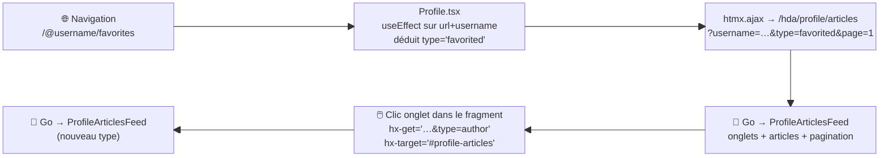

## Step-03 — Profile : pont routeur → fragment .[chapter]

`Profile.tsx` reçoit le `username` du routeur Preact et doit en déduire le type d'onglet depuis l'URL :

```ts
// Profile.tsx — tout ce qui reste pour les articles
useEffect(() => {
    const type = /.*\/favorites/.test(url) ? 'favorited' : 'author';
    window.htmx.ajax(
        'GET',
        `/hda/profile/articles?username=${encodeURIComponent(username)}&type=${type}&page=1`,
        { target: '#profile-articles', swap: 'outerHTML' }
    );
}, [url, username]);
```

De **5 états** à **1** (`user` — pour le header uniquement).

/*
Nouveau pattern : le fragment ne peut pas démarrer seul — il a besoin de paramètres que seul le routeur Preact connaît.
Le useEffect réagit aux changements d'URL ET de username : naviguer de /@alice vers /@alice/favorites recharge le fragment avec le bon type.
Après ce chargement initial, le fragment se débrouille seul pour les onglets, la pagination, le contenu.
*/

## Step-03 — Pattern 3 : routeur Preact → fragment



Preact gère l'URL. Go gère le contenu. **Frontière nette.**

/*
La séparation des responsabilités est claire et explicite.
Preact : routing, session, contexte utilisateur.
Go : rendu du contenu, onglets, pagination.
Le useEffect est le seul point de contact — un câble fin entre deux mondes indépendants.
*/
