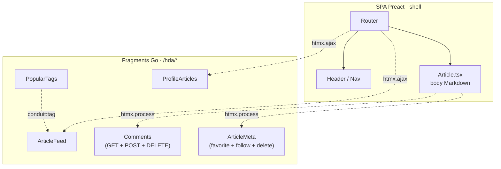

## Récapitulatif : 5 steps, 5 patterns .[chapter]

| Step |&nbsp;| Fragment migré | Ce qui est introduit |
|---|----|---|---|
| 01 |&nbsp;| PopularTags | Fragment simple + `CustomEvent` DOM |
| 02 |&nbsp;| ArticleFeed | Fragment auto-rafraîchissant + `htmx.ajax()` |
| 03 |&nbsp;| ProfileArticles | Pont routeur Preact → fragment |
| 04 |&nbsp;| Commentaires | `hx-post` / `hx-delete` + `htmx:configRequest` |
| 05 |&nbsp;| ArticleMeta | Web Component Light DOM + `hx-swap-oob` |

/*
Chaque step introduit exactement un nouveau concept.
C'est volontaire : on voulait pouvoir montrer chaque pattern isolément, sans surcharge cognitive.
Ces 5 patterns couvrent l'essentiel des cas réels : lecture simple, lecture paramétrée, routing externe, mutation authentifiée, et synchronisation de zones interactives dupliquées.
*/

## La cohabitation

/*
Voilà l'état final après les 5 steps.
Preact reste le shell : routing, header, chargement de l'article et rendu Markdown.
Go couvre les listes, la pagination, les commentaires, et maintenant les actions ArticleMeta.
La cohabitation n'est pas un état d'échec — c'est le résultat voulu d'un strangler fig bien mené.
*/
