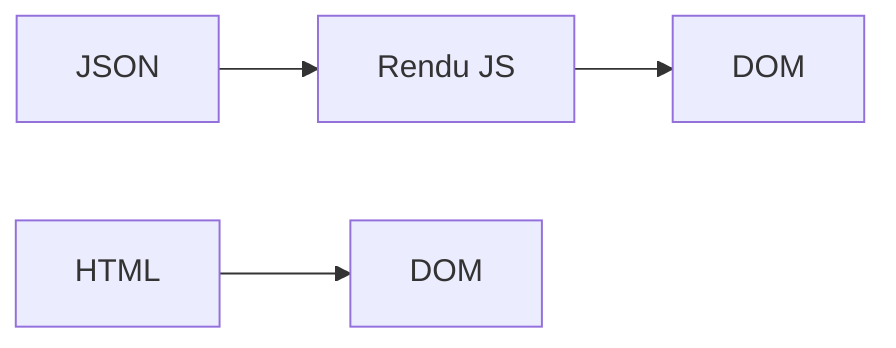

## .[chapter]

# Conclusions

/*
On sort du récit de migration pour formuler ce qu'on en retire.
L'objectif n'est pas de vendre HTMX — c'est de donner une grille de décision pour savoir quand ça vaut le coup, et quand ça ne vaut pas.
*/

## Ce qui a disparu côté client

| Composant migré | États/logique côté client supprimés |
|---|---|
| PopularTags | fetch + loading + tags[] |
| ArticleFeed (Home) | **6 → 1** (isAuthenticated) |
| ProfileArticles | **5 → 1** (user — pour le header) |
| Comments | comments[] + commentBody |
| ArticleMeta | callbacks favorite/follow/delete + synchronisation entre deux occurrences |

Moins d'état client = **moins de synchronisation à maintenir** ! 💪

/*
Ces éléments sont réels — ils viennent du diff entre step-00 et step-05.
6 états → 1 dans Home.tsx : le plus frappant.
Le point important : ces états ne portaient pas de valeur côté client. Ils ne faisaient que refléter l'état du serveur. Déplacer ce travail côté serveur n'est pas une perte — c'est une clarification des responsabilités. ArticleMeta ajoute un cas différent : on supprime surtout une synchronisation client entre deux occurrences de la même zone.
*/

## Ce qui devient plus simple .[no-bullets]

- **Moins de mapping JSON → DOM** — le serveur renvoie le rendu final 🤓
- **Navigation déclarative** — onglets et pagination vivent dans le HTML 🔒
- **Mutations sans état intermédiaire** — `hx-post` / `hx-delete` → re-rendu complet ♻️
- **Synchronisation multi-zones** — `hx-swap-oob` remplace l'autre occurrence 🚮
- **Rendu testable côté serveur** — les templates Go sont des fonctions pures 😎

/*
Ces gains sont concrets et mesurables dans le diff.
Le mapping JSON → DOM est la tâche la plus répétitive d'une SPA : récupérer des données, les mapper en JSX, gérer les états de chargement et d'erreur.
Quand le serveur envoie directement le HTML final, cette couche disparaît.
*/

## Ce qui ne disparaît pas .[no-bullets]

- **La conception des frontières** — où placer la ligne Go / Preact ? 🤔
- **L'historique navigateur** — les fragments ne changent pas l'URL 😅
- **Les interactions riches** — éditeur Markdown, drag & drop : du JS ciblé reste utile 🦄
- **Les tests end-to-end** — plus importants qu'avant (nouveaux réflexes à acquérir) 🤩
- **La duplication temporaire** — pendant la migration, deux systèmes rendent la même zone 👀

/*
HTMX ne supprime pas la conception logicielle — il déplace le curseur.
La question de la granularité des fragments, de la gestion des erreurs, du routage : tout ça reste à décider.
La duplication temporaire est normale dans un strangler fig — l'accepter explicitement évite de paniquer en la découvrant.
*/

## Nos heuristiques

1. **Migrer d'abord les lectures** — Moins de risque, rollback immédiat 🛑
2. **Remplacer un conteneur cohérent** — Un fragment doit s'actualiser de façon autonome 😌
3. **Après une mutation, réactualiser** — le serveur est la source de vérité 💪
4. **Garder du JS pour les îles "riches"** — Preact/WebComponent, mais avec une frontière claire 😎
5. **Ne jamais exposer un token dans le DOM** — `htmx:configRequest` > `hx-headers` 👮

/*
Ces règles viennent de l'expérience sur ce projet — pas de la théorie.
La règle 3 mérite d'être développée : "patch mental fragile" signifie qu'on demande au client de deviner l'état après une mutation. Le re-rendu complet élimine cette hypothèse.
La règle 5 est la seule à caractère sécurité — la seule qu'on ne peut pas transiger.
*/

## Le vrai changement



> On ne demande plus au navigateur de reconstruire l'application à partir de données.

/*
Laisser cette phrase respirer.
Dans une SPA, le serveur fournit des données et le client reconstruit l'interface.
Dans une HDA, le serveur fournit aussi les transitions d'interface, sous forme de HTML.
Ce n'est pas un retour en arrière — c'est un rééquilibrage entre ce que le client et le serveur font le mieux.
*/

## Simplix, pas simpliste

```text
SPA + JSON    → pas l'ennemi
HTML + HTMX   → pas une baguette magique

La bonne question :
"Le prochain changement produit sera-t-il plus facile à livrer ?"
```

- **Simple** — moins de couches là où elles n'apportent pas de valeur
- **Explicite** — HTTP, HTML, cibles nommées, fragments autonomes
- **Mixte** — plusieurs modèles peuvent cohabiter dans la même application

/*
Clore sans dogme.
Si HTMX réduit la distance entre une intention utilisateur et le HTML final sans rendre les frontières floues — on gagne.
Si ce n'est pas le cas sur votre projet, gardez l'outil qui marche.
Le titre "simplix" n'est pas une promesse de facilité — c'est une invitation à chercher la simplicité praticable, là où elle existe vraiment.
*/
