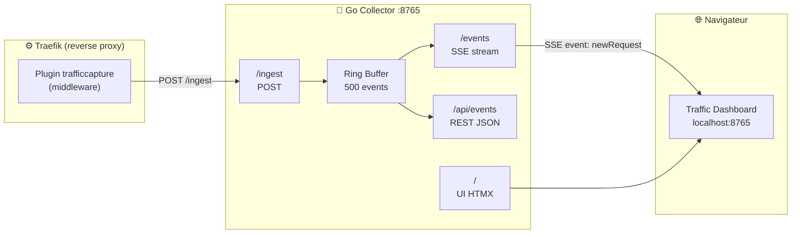
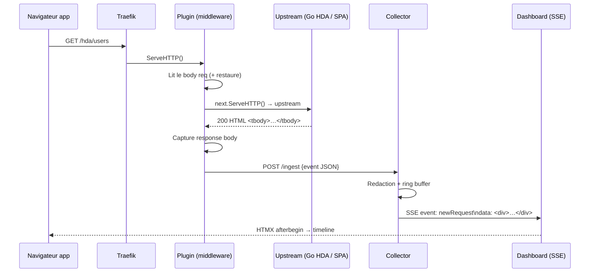
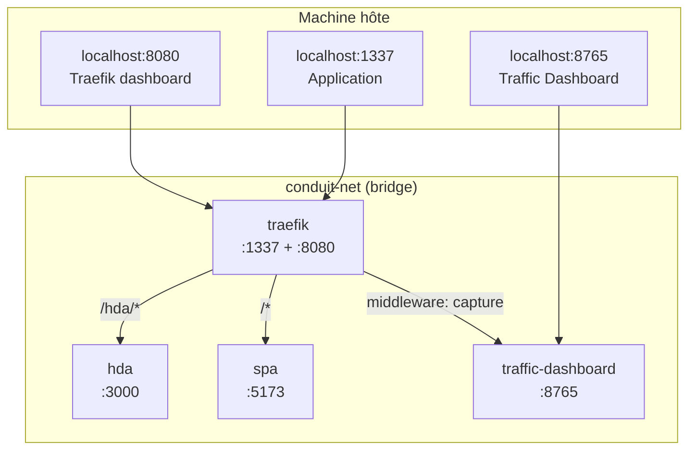

# Traffic Dashboard

Outil de visualisation du trafic HTTP en temps réel, conçu pour les conférences, ateliers et démos live.

Il rend immédiatement lisibles les échanges HTTP qui transitent par Traefik — idéal pour montrer en direct la différence entre une SPA qui échange du JSON et une HDA (Hypermedia-Driven Application) qui échange du HTML via HTMX.

> Ce n'est **pas** un outil d'observabilité. C'est un **outil de narration**.

---

## Accès à l'interface

Une fois la stack lancée (`docker compose up --build` dans `reverse-proxy/`) :

**http://localhost:8765**

L'interface se met à jour en temps réel dès qu'une requête transite par Traefik.

### Filtres disponibles dans l'UI

| Filtre | Exemple | Description |
|--------|---------|-------------|
| Route | `/hda/` | Préfixe du chemin de la requête |
| Service | `hda` | Nom du service Traefik (insensible à la casse) |
| Type | `htmx`, `html`, `json`, `js`, `css`, `img`, `font`, `text` | Type de contenu de la réponse |
| Status | `200`, `404`, … | Code HTTP exact |

Le bouton **Reset** vide la timeline et le panneau de détail.

---

## Ce qu'on voit dans la salle

```
┌────────────────────┬────────────────────┬──────────────────────────┐
│ Timeline           │ Routing            │ Payload                  │
├────────────────────┼────────────────────┼──────────────────────────┤
│ 14:03:12 GET /hda/ │ Router : hda       │ <tbody>                  │
│ users    HTML HTMX │ Service: hda       │   <tr>Alice</tr>         │
│                    │ Status : 200       │   <tr>Bob</tr>           │
│ 14:03:18 GET /api/ │ Duration: 4 ms     │ </tbody>                 │
│ users    JSON  200 │                    │                          │
│                    │ ── Headers ──      │ ── Response ──           │
│ 14:03:22 POST /hda │ HX-Request: true   │ { "users": [...] }       │
│ /users   HTML  201 │ Accept: text/html  │                          │
└────────────────────┴────────────────────┴──────────────────────────┘
```

Les badges sont colorés :

| Catégorie | Couleur |
|-----------|---------|
| HTMX (`HX-Request: true`) | violet |
| HTML | vert |
| JSON | bleu |
| JS | jaune |
| CSS | teal |
| IMG | gris-bleu |
| FONT | violet foncé |
| TEXT | gris foncé |
| 2xx | vert |
| 3xx | bleu |
| 4xx | orange |
| 5xx | rouge |

---

## Architecture



### Flux d'une requête capturée



---

## Composants

### Plugin Traefik (`plugin/`)

Middleware Traefik chargé localement via Yaegi (interpréteur Go de Traefik).

- **Stdlib uniquement** — pas de dépendances externes (contrainte Yaegi)
- Capture le body requête (puis le restaure pour l'upstream)
- Wrape le `ResponseWriter` pour capturer le body réponse
- Envoie un POST synchrone vers `/ingest` avec timeout 500 ms
- Détecte automatiquement `HX-Request: true` → flag `isHTMX`

```
plugin/
├── .traefik.yml   # métadonnées (nom, type, config de test)
├── go.mod         # module github.com/htmx-de-maniere-simplix/trafficcapture
└── plugin.go      # Config, CreateConfig, New, ServeHTTP
```

### Collector Go (`collector/`)

Serveur HTTP Echo qui reçoit, stocke et diffuse les événements.

```
collector/
├── cmd/main.go
└── internal/
    ├── config/      # valeurs par défaut (port, buffer, redaction)
    ├── model/       # Event, RequestInfo, ResponseInfo
    ├── store/       # ring buffer thread-safe (taille fixe, newest-first)
    ├── sse/         # broker fan-out → N clients SSE
    ├── filter/      # filtrage route / service / content-type / status
    ├── redact/      # redaction headers et champs JSON sensibles
    ├── server/      # routes Echo, handlers
    └── templates/   # UI : layout, timeline, détail (templ + HTMX + PicoCSS)
```

#### Routes exposées

| Méthode | Route | Description |
|---------|-------|-------------|
| `GET` | `/` | UI complète (3 panneaux) |
| `GET` | `/events` | Stream SSE — utilisé par l'UI pour le live |
| `POST` | `/ingest` | Reçoit les events du plugin Traefik |
| `GET` | `/api/events` | Liste JSON filtrée |
| `GET` | `/ui/event/:id` | Fragment HTMX : routing + payload |
| `GET` | `/ui/timeline` | Fragment HTMX : timeline filtrée |

#### Filtres disponibles (query params)

| Param | Exemple | Description |
|-------|---------|-------------|
| `route` | `/hda/` | Préfixe de chemin |
| `service` | `hda` | Nom du service Traefik |
| `contentType` | `json`, `html`, `htmx`, `js`, `css`, `img`, `font`, `text` | Type de contenu de la réponse |
| `statusCode` | `200`, `404` | Code HTTP exact |

#### Redaction par défaut

Headers : `Authorization`, `Cookie`, `Set-Cookie`

Champs JSON : `password`, `token`, `secret`

---

## Stack UI

```
PicoCSS (dark theme)    →  apparence, lisibilité projecteur
HTMX + SSE extension    →  live stream + interactions sans JS custom
templ (Go templates)    →  rendu serveur, pas de JS de build
Highlight.js            →  coloration syntaxique JSON / HTML
```

---

## Développement local

### Prérequis

```bash
go version          # 1.22+ requis
templ version       # v0.3.x (go install github.com/a-h/templ/cmd/templ@latest)
```

### Installer les dépendances

```bash
cd collector
go mod tidy
```

### Générer les templates

```bash
make templ
# ou directement :
templ generate ./internal/templates/...
```

### Lancer en mode développement (watch)

```bash
make dev
# Lance templ --watch + go run en parallèle
# Accessible sur http://localhost:8765
```

### Lancer simplement

```bash
make run
# Compile puis démarre
```

### Vérification

```bash
make vet           # go vet ./...
make build         # compile le binaire ./traffic-dashboard
```

### Tester l'ingest manuellement

```bash
curl -s -X POST http://localhost:8765/ingest \
  -H "Content-Type: application/json" \
  -d '{
    "id": "test-001",
    "timestamp": "2026-06-07T14:03:12Z",
    "router": "hda",
    "service": "hda",
    "middleware": "capture",
    "request": {
      "method": "GET",
      "path": "/hda/users",
      "query": "",
      "headers": { "HX-Request": "true" },
      "body": "",
      "isHTMX": true
    },
    "response": {
      "statusCode": 200,
      "headers": { "Content-Type": "text/html" },
      "body": "<tbody><tr><td>Alice</td></tr></tbody>",
      "durationMs": 4,
      "contentType": "text/html"
    }
  }'
```

---

## Build Docker

```bash
cd collector
docker build -t traffic-dashboard .
```

Le Dockerfile est multi-stage :

1. **Build stage** (`golang:1.25-alpine`) :
   - Installe `templ`
   - `go mod tidy` → génère `go.sum`
   - `templ generate` → génère les `*_templ.go`
   - `go build` → binaire `./traffic-dashboard`

2. **Runtime stage** (`alpine:3.21`) :
   - Copie uniquement le binaire
   - Port 8765

---

## Déploiement via Docker Compose

Le `docker-compose.yml` parent (`reverse-proxy/`) intègre tout.

### Architecture de déploiement



### Lancer la stack complète

```bash
cd reverse-proxy
docker compose up --build
```

| URL | Service |
|-----|---------|
| http://localhost:1337 | Application (SPA + HDA) |
| http://localhost:8080 | Dashboard Traefik |
| **http://localhost:8765** | Traffic Dashboard |

### Lancer uniquement le collector (sans plugin)

Utile pour développer l'UI sans Traefik :

```bash
cd reverse-proxy
docker compose up --build traffic-dashboard
```

### Reconstruire seulement le collector après une modification

```bash
cd reverse-proxy
docker compose up --build traffic-dashboard
```

### Logs

```bash
docker compose logs -f traffic-dashboard
docker compose logs -f traefik   # pour voir le chargement du plugin
```

---

## Configuration

La configuration est définie dans [`collector/internal/config/config.go`](collector/internal/config/config.go) et applicable via variables d'environnement (évolution future) ou modification directe pour les démos.

| Paramètre | Défaut | Description |
|-----------|--------|-------------|
| `ListenAddr` | `:8765` | Port d'écoute du collector |
| `BufferSize` | `500` | Nombre max d'events en mémoire |
| `MaxBodySize` | `32768` | Taille max du body capturé (32 KB) |
| `RedactHeaders` | `Authorization, Cookie, Set-Cookie` | Headers masqués |
| `RedactFields` | `password, token, secret` | Champs JSON masqués |

Le plugin Traefik est configuré via les labels Docker dans `docker-compose.yml` :

```yaml
- "traefik.http.middlewares.capture-hda.plugin.trafficcapture.collectorURL=http://traffic-dashboard:8765"
- "traefik.http.middlewares.capture-hda.plugin.trafficcapture.maxBodySize=32768"
- "traefik.http.middlewares.capture-hda.plugin.trafficcapture.routerName=hda"
- "traefik.http.middlewares.capture-hda.plugin.trafficcapture.serviceName=hda"
```

---

## Ajouter le middleware sur un nouveau router Traefik

Pour capturer le trafic d'un service supplémentaire, ajouter ce label à son service dans `docker-compose.yml` :

```yaml
labels:
  - "traefik.http.middlewares.capture-mon-service.plugin.trafficcapture.collectorURL=http://traffic-dashboard:8765"
  - "traefik.http.middlewares.capture-mon-service.plugin.trafficcapture.routerName=mon-service"
  - "traefik.http.middlewares.capture-mon-service.plugin.trafficcapture.serviceName=mon-service"
  - "traefik.http.routers.mon-service.middlewares=capture-mon-service@docker"
```

---

## Limitations connues

- **In-memory uniquement** — les events sont perdus au redémarrage du collector (voulu)
- **Pas de WebSocket** — seul HTTP/HTTPS terminé par Traefik est capturé
- **Pas de gRPC, pas d'HTTP/3**
- **SSE passthrough** — si un service en aval envoie des SSE, le plugin les bufférise entièrement avant de les transmettre (problème théorique, sans impact en démo low-traffic)
- **Plugin synchrone** — le POST vers `/ingest` ajoute ~1–5 ms de latence (négligeable en démo locale)
